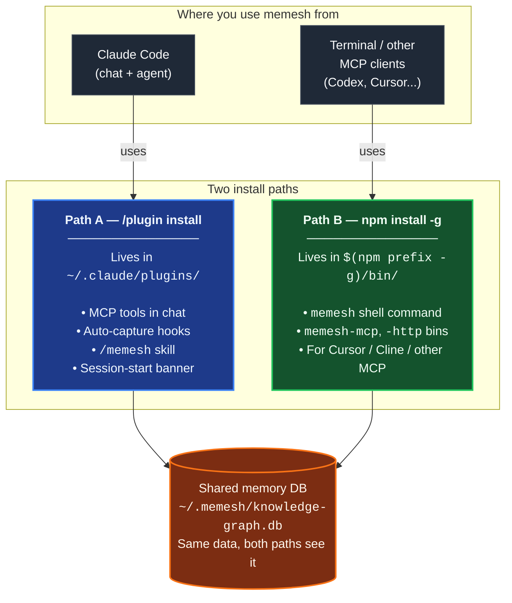

🌐 [English](README.md) | [繁體中文](README.zh-TW.md) | [Deutsch](README.de.md)

<p align="center">
  <h1 align="center">MeMesh</h1>
  <p align="center">
    <strong>Gemeinsamer Speicher und dauerhafte lokale Koordination für Coding-Agenten.</strong><br />
    Eine SQLite-Datei. Kein Docker. Keine Cloud erforderlich.
  </p>
  <p align="center">
    <a href="https://www.npmjs.com/package/@pcircle/memesh"></a>
    <a href="LICENSE"></a>
    <a href="https://nodejs.org"></a>
    <a href="https://modelcontextprotocol.io"></a>
  </p>
</p>

---

**MeMesh** ist die **Open-Source-Kollaborationsschicht** für lokale KI-Coding-Agenten: gemeinsamer Speicher, dauerhafte Nachrichten an einen bestimmten Empfänger und kontrollierte Memory-to-Product-Vorschläge für Claude Code, Codex, Cursor, eigene Agenten und kompatible lokale MCP-Clients. Alles liegt in einer SQLite-Datei. Kein Docker und keine Cloud erforderlich.

### Neue Kollaborationsflächen

- `message` gibt lokalen Agenten einen dauerhaften Exact-Recipient-Posteingang mit Cursor-Recovery und expliziten Receipts über MCP, HTTP und CLI.
- `message discover` liefert ein begrenztes, projektbezogenes Verzeichnis aktiver Agenten mit Session, Principal, Host-Art, deklariertem Model/Work (oder ausdrücklich unbekannt) und aktiven Leases; es führt keine Nachrichten- oder Receipt-Aktion aus.
- `improvement` verwandelt aktive Memories in evidenzverknüpfte Produktarbeits-Vorschläge; Agenten dürfen sie einreichen und ihren Status lesen, aber nur ein Mensch darf annehmen oder ablehnen.

## Installation

**In Claude Code** — diese zwei Zeilen im Chat eingeben (Hooks, Memory-Tools und der `/memesh`-Skill werden automatisch eingerichtet):

```
/plugin marketplace add PCIRCLE-AI/memesh
/plugin install memesh@pcircle-memesh
```

Claude Code neu starten. Eine `◉ MeMesh`-Statuszeile am Anfang der nächsten Session bestätigt, dass der SessionStart-Hook seine Statusausgabe erzeugt hat.

**Im Terminal** — die `memesh`-CLI, das Dashboard und der `memesh-mcp`-Server für Codex / Cursor und kompatible lokale MCP-Clients (braucht [Node 22.13+](https://nodejs.org)):

```bash
npm install -g @pcircle/memesh
memesh doctor        # prüft diese Installation Ende-zu-Ende
```

Die meisten Claude-Code-Nutzer installieren am Ende **beides**. Beide nutzen dieselbe Datenbank und kommen sich nicht in die Quere. Details, weitere Agenten und Upgrades stehen unten unter „In 60 Sekunden starten".

## Das Problem

Ihr Coding-Agent vergisst zwischen zwei Sessions nicht nur Fakten. Schlimmer: er **macht dieselbe Arbeit noch einmal**.

- Er schlägt wieder den Ansatz vor, den Sie letzten Monat abgelehnt haben
- Er stolpert erneut über denselben fehlschlagenden Test
- Er „entdeckt" die Einschränkung wieder, die im März die Produktion lahmgelegt hat
- Er bittet Sie, ihm die Architektur zu erklären, die er selbst mitentworfen hat

Das ist kein Problem des Chatverlaufs. Was zwischen Sessions überleben muss, ist nicht das Gespräch, sondern die *Arbeit*: welche Entscheidungen gefallen sind, warum, was fehlgeschlagen ist, wie es behoben wurde — und wie das alles zusammenhängt.

**Genau diese Lücke füllt MeMesh.** Es tut drei Dinge:

- **Automatisch festhalten**: Hooks erfassen, was der Agent wirklich tut — Sessions, Commits, Fehlschläge. Keine handgeschriebenen Notizen
- **Zurückgeben, wenn es zählt**: beim Session-Start und vor jeder Dateibearbeitung landen die passenden Memories vor dem Agenten
- **Nicht verrotten lassen**: explizite Relationen kennzeichnen Ablösung, Widerspruch und Kausalität und halten den Wissensgraphen ehrlich

Installation über npm, gespeichert wird in `~/.memesh/knowledge-graph.db`, angebunden an Claude Code oder jeden MCP-fähigen Client.

> [!IMPORTANT]
> **Aktiv entwickeltes Projekt** — Funktionen entwickeln sich kontinuierlich weiter und können sich zwischen Releases ändern. Mit `memesh feedback --bug`, `--feature` oder `--question` bereiten Sie einen öffentlichen Issue-Entwurf zur Prüfung vor.

---

## Lokale Agenten-Zusammenarbeit — mit klaren Grenzen

Alle Hosts, die mit derselben lokalen MeMesh-Instanz verbunden sind, teilen dauerhaften Speicher. Das `message`-Tool ergänzt einen expliziten Nachrichtenpfad über MCP, HTTP und CLI.

Die optionale sichere Host-Native-Wakeup-Laufzeit unterstützt derzeit macOS und Linux. MeMesh-Kernspeicher, dauerhafte Nachrichtenspeicherung und MCP-Tools bleiben unter Windows verfügbar; Host-Native-Wakeup unter Windows wird noch nicht unterstützt.

- Heute verfügbar: Ein Sender über MCP, HTTP oder CLI kann einen nicht vertrauenswürdigen, JSON-kodierten Payload von höchstens 65.536 UTF-8-Bytes (64 KiB) dauerhaft an genau einen lokalen Empfänger senden. Der Empfänger kann ihn getrennt abrufen, nach einem Neustart mit einem opaken Cursor fortsetzen und Intake, Bestätigung, Workflow-Status und Host-Aktivierung getrennt protokollieren.
- Mit aktiviertem MeMesh-Codex-Plugin registriert sich jeder gestartete oder fortgesetzte Codex-Thread automatisch mit einer threadbezogenen Identität; ein manuelles `agent setup` ist nicht erforderlich. Die exakt aktive Session erhält eine vollständige Nachricht über ihre native Queue — ohne Polling oder menschliche Erinnerung und ohne zweiten Inbox-Abruf. `memesh agent setup codex-session` bleibt optional, wenn ein Workspace einen stabil benannten Principal benötigt. Der vollständige native Envelope einschließlich Routing-Metadaten und Payload ist separat auf 16.384 Bytes (16 KiB) begrenzt. Ein Exact-Session-Send ist erst erfolgreich, wenn die native Queue ihn annimmt; ein zu großer Envelope meldet `native_message_too_large`, andere nicht verfügbare oder abgelehnte Sessions melden `recipient_unavailable`. Eingegrenzte Recovery-Daten bleiben erhalten, und Principal-Ziele behalten Durable Store-and-Forward bei.
- Eine erfolgreiche Queue-Annahme (`host_accept`) bedeutet nur, dass die lokale Codex-Queue die größenbegrenzte Nachricht annahm. Sie beweist nicht, dass ein Agent sie gelesen, bestätigt oder die Arbeit akzeptiert hat. Codex übernimmt den Text über das Prozessargument `--message`; deshalb kann eine Prozessinspektion desselben Benutzers ihn während des kurzen Queue-Aufrufs sehen. Native Nachrichten dürfen keine Secrets enthalten.
- Der dauerhafte Nachrichtenspeicher wird durch eine Owner-Richtlinie begrenzt, nicht still gelöscht: `memesh message storage report` zeigt logische Payload-Größe, geschützte Zeilen, wiederverwendbare SQLite-Seiten und WAL-Größe. Das begrenzte Pruning ist standardmäßig ein Dry Run und tombstoniert nur alte terminale Payloads. Ein optionales `MEMESH_AGENT_MESSAGE_STORAGE_QUOTA_BYTES` lehnt einen zu großen Send atomar ab. Siehe [begrenzte Speicherung und Audit-Aufbewahrung](docs/platforms/agent-messaging.md#bounded-storage-and-audit-retention).
- Eine gestoppte, fehlende oder getrennte Codex-Session wird weder geweckt noch ersetzt. Ihr dauerhafter Posteingang bleibt für Audit und Wiederherstellung erhalten; `poll` und `memesh message watch` sind Kompatibilitäts- und Diagnosepfade. Native Zustellung setzt keine beendete Modell-Session fort, führt keinen Payload aus und gilt nicht als Bestätigung.
- Kooperative Vertrauensgrenze: Der Empfängername ist eine logische Routing-ID, keine Anmeldung oder ACL pro Agent. Jeder Aufrufer mit Zugriff auf dieselbe lokale MeMesh-Instanz muss als vertrauenswürdiger Workspace-Teilnehmer gelten; Host-Adapter setzen weiterhin ihre eigenen Berechtigungen und menschlichen Freigaben durch.
- Adapter-Grenze: Der hier beschriebene native Wakeup ist nur der konfigurierte lokale Codex-Session-Pfad. Andere lokale MCP-Loops können die dauerhaften Nachrichtenoperationen nutzen, die ihr eigener Host-Loop unterstützt; dies ist keine universelle Host-Support-Aussage.

Der Leitfaden [Local Agent Messaging](docs/platforms/agent-messaging.md) beschreibt Lifecycle, Support-Matrix und Grenzen im Detail.

### Agenten-Erfahrung in geprüfte Produktarbeit überführen

Das `improvement`-Tool wandelt aktive Memories und Lessons in einen evidenzverknüpften Verbesserungsvorschlag um. Agenten dürfen Vorschläge einreichen und ihren Status lesen, aber nicht selbst akzeptieren oder ablehnen. Nach menschlicher Freigabe bleiben alle Quellen erhalten, der neue Arbeitseintrag wird mit ihnen verknüpft und erscheint in späteren Projekt-Briefings.

---

## Installationspfade auf einen Blick

MeMesh hat **zwei Installationspfade, die nebeneinander existieren**. Die meisten Nutzer brauchen beide. Beide schreiben in die **selbe Speicher-Datenbank** (`~/.memesh/knowledge-graph.db`), so dass im Claude-Code-Chat erfasste Memories auch in deiner Shell erscheinen und umgekehrt.



**Welchen brauchst du?**

| Was du willst | Installationspfad |
|---|---|
| `/memesh` skill im Claude-Code-Chat verwenden | Path A (Plugin) |
| Auto-Capture in Claude Code (Session → Lessons → nächste Recall) | Path A (Plugin) |
| `memesh remember` / `memesh recall` / `memesh doctor` im Terminal | Path B (npm-global) |
| `memesh serve` direkt zum Öffnen des Dashboards (ohne `npx`-Startverzögerung) | Path B (npm-global) |
| MCP-Tools in Codex CLI verwenden | Codex-Plugin (ohne manuelle Konfiguration) oder Path B |
| `memesh-mcp` an Cursor, Cline oder andere MCP-Clients anbinden | Path B (npm-global) |
| Alles oben | **Beide installieren** — kein Konflikt |

> **Häufiges Missverständnis**: Das Claude-Code-Plugin legt `memesh` **nicht** auf deinen Shell-`PATH`. Wenn du nur `/plugin install` läufst und dann im Terminal `memesh reindex` tippst, siehst du `command not found`. Das ist normal — für den Shell-Befehl brauchst du zusätzlich `npm install -g @pcircle/memesh`.

### ⚠️ Das Plugin installiert NICHT das CLI

Das ist die häufigste Verwechslung. Einmal lesen, spart dir später Zeit:

- `/plugin install memesh@pcircle-memesh` aus Claude Code → installiert **nur Path A**. Du erhältst MCP-Tools, Hooks, das `/memesh` skill. `memesh` landet **nicht** auf deinem Shell-`PATH`.
- `memesh reindex` / `memesh update` / `memesh doctor` im Terminal → braucht **Path B** (npm-global). Sonst: `zsh: command not found: memesh`.
- **Empfohlenes Setup für Claude-Code-Nutzer**: **beide installieren**. Koexistieren, teilen sich dieselbe DB, kein Konflikt.

```bash
# Nach /plugin install ..., auch das ausführen:
npm install -g @pcircle/memesh
```

Wenn du memesh nur im Claude-Code-Chat verwendest (nie `memesh` im Terminal tippst), reicht Path A. Alle anderen: beide installieren.

---

## In 60 Sekunden starten

### Option A — Claude-Code-Plugin (Installation in einer Zeile)

Wenn Sie Claude Code nutzen, installieren Sie MeMesh als Plugin direkt in der CLI:

```
/plugin marketplace add PCIRCLE-AI/memesh
/plugin install memesh@pcircle-memesh
```

Claude Code verdrahtet Hooks, Skills und den MCP-Server automatisch. Sie erhalten Auto-Capture in der Session, proaktives Recall, den `/memesh`-Skill in der Unterhaltung und `remember` / `recall` / `forget` / `learn` als MCP-Tools für den Agenten.

**Prüfen:** Claude Code neu starten und eine beliebige Session beginnen. Eine Statuszeile wie `◉ MeMesh ready · no memories for "your-project" yet` erscheint oben — sie bestätigt direkt die Statusausgabe des SessionStart-Hooks. Sie allein beweist nicht, dass spätere Capture- oder Recall-Vorgänge funktionieren. (Mit vorhandenen Memories zeigt sie stattdessen Zähler.)

### Option B — npm global (optionale Optimierung)

Wenn Sie das Binary direkt im `PATH` möchten (damit `memesh` in jedem Terminal ohne `npx`-Verzögerung läuft) oder `memesh-mcp` als stdio-Befehl mit festem Pfad für MCP-Clients außerhalb von Claude Code (Cursor, Cline) bereitstellen wollen:

```bash
npm install -g @pcircle/memesh
```

### Schritt 1.5: MeMesh in Claude Code einbinden (empfohlen, einmalig)

`npm install -g` legt die CLI in den PATH — aber nichts ist damit in Claude Code eingebunden: Das npm-Paket führt bewusst keine Install-Skripte aus; MCP-Server und Hooks in Claude Code registriert das Plugin (Option A). Was der npm-Pfad selbst verdrahten kann, sind die Session-Hooks. Ohne diese Hooks können Sie `memesh remember` / `recall` manuell verwenden, aber die **Auto-Capture-Schleife** (Session → Lektionen → proaktive Erinnerung in der nächsten Session) bleibt stumm.

```bash
memesh setup                 # prüft die lokale Host-Verdrahtung und meldet den Befund
```

Oder die Einzelschritte von Hand:

```bash
memesh install-hooks         # fügt memesh-Hooks zu ~/.claude/settings.json hinzu
memesh setup --check         # Prüfung auf Maschinenebene: liest die Host-Configs, ändert nichts
```

Die Hooks existieren neben Ihren bestehenden Custom-Hooks unter `~/.claude/hooks/` — `install-hooks` schreibt additiv und überschreibt nie Ihre Einträge. Zum Entfernen: `memesh uninstall-hooks`.

### Dieselben Memories aus Codex CLI, Cursor und anderen MCP-Clients

Die Installation über den Codex-Plugin-Marketplace deklariert den gebündelten MCP-Server automatisch. Sie startet `dist/mcp/server.js` direkt aus dem Plugin-Cache; eine globale Installation und `codex mcp add` sind dafür nicht erforderlich:

```bash
codex plugin marketplace add PCIRCLE-AI/memesh
codex plugin add memesh@pcircle-memesh
```

`memesh-mcp` ist außerdem ein gewöhnlicher stdio-MCP-Server. Mit installierter Option B (`memesh-mcp` im `PATH`) kann er als manuelle Alternative registriert werden:

```bash
# OpenAI Codex CLI — schreibt [mcp_servers.memesh] in ~/.codex/config.toml
codex mcp add memesh -- memesh-mcp
```

Für Cursor fügen Sie denselben stdio-Server in `~/.cursor/mcp.json` (global)
oder in `.cursor/mcp.json` (projektspezifisch) ein:

```json
{
  "mcpServers": {
    "memesh": { "command": "memesh-mcp" }
  }
}
```

Jeder konfigurierte lokale Host liest und schreibt dieselbe `~/.memesh/knowledge-graph.db` — eine in einem Agenten gespeicherte Memory ist aus Codex, Cursor oder einem anderen MCP-Client abrufbar. Prüfen:

```bash
codex mcp list       # memesh sollte als enabled gelistet sein
```

> **Als konfigurierten Befehl `memesh-mcp` verwenden, NICHT `npx -p @pcircle/memesh`.** `npx -p` löst zum *lokalen* Paket auf, sobald das Arbeitsverzeichnis des Hosts in einem Checkout dieses Repositories liegt — und führt dann stillschweigend dessen aktuellen Stand statt des installierten Release aus.

### Native Integration: Hermes Agent

**Hermes Agent** (NousResearch) verfügt über ein erstklassiges `MemoryProvider`-Pluginsystem — MeMesh integriert sich auf derselben Ebene wie Hermes' eigene eingebaute Memory-Backends (honcho, mem0, hindsight), nicht als HTTP-Bridge. Anders als im MCP-Modus, wo Sie Tools manuell aufrufen, führt Hermes' Provider-System `recall`/`remember` bei jedem Turn automatisch aus.

Die Integration mappt Hermes' `prefetch()`- und `sync_turn()`-Hooks direkt auf MeMesh' HTTP-API. Vollständiger Leitfaden mit Provider-Codestruktur, Konfiguration und vier echten Fallstricken aus einem Live-Deployment: **[docs/platforms/hermes-agent.md](docs/platforms/hermes-agent.md)**

### Native Integration: OpenClaw

**OpenClaw** verfügt über ein erstklassiges Memory-Capability-Pluginsystem — MeMesh integriert sich auf derselben Ebene wie OpenClaw's eigene eingebaute Backends (LanceDB), nicht als HTTP-Bridge. Das Plugin registriert sich über `api.registerMemoryCapability()` und stellt `memory_recall`/`memory_store`/`memory_forget`-Tools sowie automatisches Recall beim `before_prompt_build`-Hook bereit.

**Hauptunterschied zu Hermes**: OpenClaw's Auto-Capture ist schwellenwertgesteuert (max. 3 Memories/Turn bei Trigger), nicht bei jedem Turn. Die Integration mappt auf MeMesh' HTTP-API (`/v1/recall`, `/v1/remember`, `/v1/forget`). Vollständiger TypeScript-Plugin-Vertrag, Konfigurationsform und Fallstricke: **[docs/platforms/openclaw.md](docs/platforms/openclaw.md)**

### Schritt 2: Entscheidung speichern

```bash
memesh remember "Use OAuth 2.0 with PKCE for the new auth"
```

Oder nutzen Sie die explizite Form, wenn Sie einen stabilen Namen und Typ zum späteren Filtern möchten:

```bash
memesh remember --name "auth-decision" --type "decision" --obs "Use OAuth 2.0 with PKCE"
```

### Schritt 3: Später abrufen

```bash
memesh recall "login security"
# → Findet "OAuth 2.0 with PKCE" auch mit anderen Suchbegriffen
```

**Das ist alles.** MeMesh merkt sich jetzt Informationen über Sessions hinweg.

Um Installation und lokale Integration End-to-End zu überprüfen:

```bash
memesh doctor
```

Dashboard öffnen, um den Speicher zu erkunden:

```bash
memesh serve
```

<p align="center">
  
</p>

<p align="center">
  
</p>

<p align="center">
  
</p>

### Sehen, was es sich gemerkt hat

Ein Befehl zeigt jederzeit, was Ihr Agent über das aktuelle Projekt weiß — wo die Arbeit stand, Entscheidungen, Lektionen, jüngste Aktivität (verpackt als Referenzdaten):

```bash
memesh briefing
```

```text
Where "your-project" was left off (today):
- Goal: Ship the payment retry logic
- Next: Open the PR once CI is green

Decisions and direction for "your-project":
- [decision] Use FTS5 as the retrieval baseline
```

Denselben Block erhält Claude Code automatisch beim Session-Start, und jeder andere MCP-Client über das `briefing`-Tool — der Agent startet orientiert, statt das Repository neu zu lesen, und Sie erklären letzte Woche nicht noch einmal. Das Dashboard (`memesh serve`) ist die vollständige visuelle Ansicht. Ein allgemeiner `briefing`-Aufruf oder SessionStart-Kontext hat keine Empfängeridentität und meldet daher keine ungelesenen Nachrichten. Zum Prüfen eines Postfachs geben Sie den exakten `project` und `recipient` an; MeMesh meldet nur dessen noch nicht abgerufene Zustellungen und verweist zuerst auf Polling, dann auf Fetch.

### Ihre Daten

- **Eine lokale Datei.** Alles liegt in `~/.memesh/knowledge-graph.db` — SQLite, auf Ihrer Festplatte. Recall und regelbasierte Erfassung benötigen keinen Anbieter, API-Schlüssel oder Modell-Download.
- **Backup = diese eine Datei kopieren.** Wiederherstellen = zurückkopieren.
- **Aufzeichnung jederzeit pausieren**: `export MEMESH_AUTO_CAPTURE=false`.
- **Alles löschen**: `~/.memesh/` entfernen.

---

## Für wen ist das gedacht?

| Wenn Sie... | hilft Ihnen MeMesh... |
|---------------|---------------------|
| **Claude Code verwenden** | Projektentscheidungen, dateispezifische Erkenntnisse und vergangene Fehler während der Arbeit automatisch abrufen |
| **Power-User von Coding-Agenten** | Eine lokale Speicherschicht über MCP-kompatible Tools verteilen |
| **Codex, Cursor, Claude Code oder einen anderen MCP-Client einzeln nutzt** | Eine lokale Speicherschicht über Agenten und Sessions hinweg verwenden |
| **einen Agenten integrieren** | Lokalen Speicher via MCP, HTTP oder CLI hinzufügen |

---

## Speziell für Coding-Agenten entwickelt

<table>
<tr>
<td width="33%" align="center">

**Claude Code / Desktop**
```bash
memesh-mcp
```
MCP-Tools + Claude Code Hooks

</td>
<td width="33%" align="center">

**Beliebige HTTP-Clients**
```bash
curl localhost:3737/v1/recall \
  -H "Content-Type: application/json" \
  -d '{"query":"auth"}'
```
`memesh serve` (REST API)

</td>
<td width="33%" align="center">

**Jedes LLM (OpenAI-Format)**
```bash
memesh export-schema \
  --format openai
```
Tools in beliebige API-Aufrufe einfügen

</td>
</tr>
</table>

---

## Warum nicht OpenMemory, Cursor Memories, Mem0 oder Zep?

| | **MeMesh** | OpenMemory | Cursor Memories | Mem0 | Zep / Graphiti |
|---|---|---|---|---|---|
| **Beste Eignung** | Lokaler Speicher für Coding-Agenten | Lokaler/MCP-basierter Cross-Client-Speicher | Cursor-natives Projektgedächtnis | Verwalteter App-/Agent-Speicher | Temporale Wissensgraphen |
| **Installationsform** | `npm install -g @pcircle/memesh` | Lokale App/Server-Flow | In Cursor eingebaut | Cloud API / SDK / MCP | Service/Framework-Setup |
| **Speicherung** | Eine lokale SQLite-Datei | Lokaler Memory-Stack | Cursor-verwaltete Regeln/Memories | Gehostet oder selbstgehostet | Graphdatenbank |
| **Cloud erforderlich** | Nein | Nein im lokalen Modus | Abhängig von Cursor-Konto/-Einstellungen | Ja für Plattform | Meist ja/selbstgehostet |
| **Claude Code Hooks** | Erste Klasse | MCP-Tools | Nein | MCP-Tools | Nicht Claude Code-spezifisch |
| **Dashboard** | Eingebaut | Eingebaut | Cursor-Einstellungen | Plattform-Dashboard | Plattform/Graph-Tools |
| **Tradeoff** | Einfache lokale Lösung, nicht Enterprise-skaliert | Größerer lokaler App-Footprint | An Cursor gebunden | Starke verwaltete Plattform, weniger lokal | Starkes Graph-Modell, aufwendigere Einrichtung |

**MeMesh tauscht Enterprise-skalierte verwaltete Infrastruktur gegen sofortige lokale Einrichtung, inspektierbaren Speicher und Coding-Agent-Workflow-Hooks.**

---

## Benchmarks — 95.60% R@5 auf LongMemEval-S

MeMeshs Retrieval-Engine ist **FTS5 alleine** (kein LLM, keine Embeddings auf dem Hot Path), gemessen am öffentlichen [LongMemEval-S](https://huggingface.co/datasets/xiaowu0162/longmemeval) Benchmark (500 Fragen, MIT-lizenziert):

| System | R@5 | Quelle |
|---|---|---|
| **MeMesh (Mode A, via `recallEnhanced()`)** | **95.60%** | [benchmarks/longmemeval/RESULTS.md](benchmarks/longmemeval/RESULTS.md) |
| MemPalace | 96.6% | Eigenangabe des Anbieters |
| Supermemory | ~82% | Schätzung des Anbieters |
| Zep | 63.8% | LongMemEval-Paper |
| Mem0 | 49.0% | LongMemEval-Paper |

Reproduktionsbefehle, Datensatz-SHA256, rohe Ergebnisse pro Frage und Analyse bekannter Fehlschläge finden sich vollständig in [`benchmarks/longmemeval/`](benchmarks/longmemeval/). In ~10 Sekunden reproduzierbar.

---

## Was läuft in Claude Code automatisch ab

Sie müssen nicht manuell alles speichern. MeMesh verfügt über **9 Hooks**, die Wissen während der Arbeit erfassen und injizieren:

| Wenn | Was MeMesh tut |
|------|------------------|
| **Am Anfang jeder Session** | Lädt Ihre relevantesten Memories + proaktive Warnungen aus früheren Lektionen + Agentur-Orchestrierungs-Banner |
| **Vor Dateibearbeitungen** | Ruft Memories ab, die an die Datei oder das Projekt gebunden sind, bevor Claude Code schreibt |
| **Wenn Sie etwas zu merken bitten** | Erkennt „remember this“-/„guardar en memesh“-/„sauvegarder dans memesh“-/„記下來“-Absicht und erinnert an MeMesh |
| **Nach jedem `git commit`** | Erfasst Ihre Änderungen mit Diff-Statistiken |
| **Nachdem ein Plan genehmigt oder eine Frage beantwortet wurde** | Erinnert Claude daran, die Entscheidung mit `remember` zu speichern, falls sie es wert ist — höchstens einmal pro Tool und Session |
| **Wenn Claude stoppt** | Erfasst bearbeitete Dateien und behobene Fehler; generiert automatisch strukturierte Lektionen aus Fehlern |
| **Vor Context-Verdichtung** | Speichert Wissen, bevor es durch Context-Limits verloren geht |
| **Vor riskanten Befehlen und Edits** | Löst die von Ihnen akzeptierten Lektions-Guards aus — eine Warnung genau in dem Moment, in dem sich ein erfasster Fehler wiederholen würde |
| **Wenn eine optierte Codex-Session startet oder fortgesetzt wird** | Registriert genau diesen aktiven Thread für die native Zustellung größenbegrenzter vollständiger Nachrichten; andere Workspaces und gestoppte Sessions werden nicht angehängt |

> **Jederzeit abschalten:** `export MEMESH_AUTO_CAPTURE=false`

---

## Konfiguration

Die gesamte Konfiguration erfolgt über Umgebungsvariablen. Die Standardwerte sind rein lokal und ohne Netzwerk — Sie müssen nichts setzen, um ein funktionierendes System zu erhalten.

| Variable | Standard | Was sie bewirkt |
|---|---|---|
| `MEMESH_DB_PATH` | `~/.memesh/knowledge-graph.db` | Überschreibt den Speicherort der SQLite-Datenbank. |
| `MEMESH_AUTO_CAPTURE` | `true` | Deaktiviert die Auto-Capture-Hooks (`Stop`, `PreCompact`) vollständig. |
| `MEMESH_AUTO_UPDATE` | `off` | Auto-Update-Richtlinie. `off` (Standard) aktualisiert nie automatisch; `patch` erlaubt `X.Y.Z → X.Y.Z+N`; `minor` ergänzt `X.Y.Z → X.Y+1.0`; `major` erlaubt jedes Bump. Wenn zugelassen, läuft am Session-Ende (Stop-Hook) ein abgekoppeltes `npm install -g`, sodass es Ihre Arbeit nie blockiert — Ergebnisse landen in `~/.memesh/auto-update.log`. Ebenfalls als `autoUpdate` in `~/.memesh/config.json` setzbar (Env hat Vorrang). Eine Maintainer-Deprecation-Warnung überschreibt `off` niemals: Aktualisieren Sie manuell oder wählen Sie eine Richtlinie, die den Bump erlaubt. |

`memesh doctor` gibt die aufgelöste Konfiguration aus, sodass Sie sehen, was aktiv ist.

Wenn Sie von einer Version aktualisiert haben, die `llm`, `llmFallbacks`,
`embedder`, `language` oder `transcriptMining` in `~/.memesh/config.json`
gespeichert hat, warnt `memesh doctor`, dass diese nicht mehr unterstützten
Schlüssel noch auf dem Datenträger liegen. MeMesh ignoriert sie, zeigt ihre
Werte nie an und löscht sie nicht automatisch. Prüfen Sie die Datei nur lokal,
entfernen Sie ausschließlich die genannten Schlüssel und fügen Sie die Datei
nicht in ein Issue ein, da sie alte Anbieterzugangsdaten enthalten kann.

Wenn npm eine installierte Version als veraltet kennzeichnet (typischerweise eine Sicherheitswarnung), stellt der nächste Session-Start ein deutliches `⚠️ MeMesh <ver> is DEPRECATED`-Banner voran und `memesh update-status` zeigt dieselbe Zeile, bis Sie aktualisiert haben. Die Prüfung wird unter `~/.memesh/update-check.<version>.json` zwischengespeichert, sodass ein vorübergehender Netzwerkfehler die Warnung nicht abschwächen kann.

---

## Dashboard

5 Reiter, 11 Sprachen, keine externen Abhängigkeiten. Zugang unter `http://localhost:3737/dashboard` wenn der Server läuft.

| Reiter | Was Sie sehen |
|--------|-------------|
| **Home** | Die nächste nützliche Aktion, ausstehende Arbeitspaket-Vorschläge zur menschlichen Annahme oder Ablehnung sowie eine Analyseansicht bei Bedarf |
| **Memories** | Die ganze Bibliothek hinter einer Oberfläche — Sofortfilter plus Enter für FTS5-gerankte Suche, Scope-Chips für Arbeit, Belege, alle und archivierte Einträge, aufklappbare Details sowie Archivieren/Wiederherstellen inline |
| **Project** | Die Geschichte eines Projekts — die Roadmap-Ansicht (Phasen, Meilensteine, Schlüssellektionen) hinter einem Projektwähler |
| **Graph** | Interaktiver kraft-gerichteter Wissensgraph mit Typfiltern, Suche, Ego-Modus, Aktualitäts-Heatmap |
| **Settings** | Update-Richtlinie und -Status sowie ein sofortiger, browserlokaler Sprachwahlschalter |

---

## Intelligente Features

**🧠 Schnelle lokale Suche** — MeMesh nutzt SQLite FTS5 auf dem Recall-Pfad. Suchwörter werden per OR verknüpft und anhand von Aktualität, Häufigkeit, Konfidenz und Abruf-Auswirkung gewichtet; kein Anbieter oder Modell wird aufgerufen.

**🌏 Suche in Schriften ohne Wortzwischenräume** — Chinesisch, Japanisch, Koreanisch, Thai, Laotisch, Khmer und halbbreites Katakana werden als überlappende Zeichenpaare indiziert. Eine als 「資料庫遷移前一定要先備份」 gespeicherte Erinnerung findet man deshalb mit 「備份」 — und nicht nur über den exakten Volltext. Der Text wird beim Schreiben wie beim Suchen normalisiert (NFC), sodass unter macOS oder mit einer koreanischen bzw. vietnamesischen Eingabemethode getippte Erinnerungen in beiden Schreibweisen gefunden werden.

**📊 Bewertetes Ranking** — Ergebnisse geordnet nach Relevanz (30%) + Aktualität (25%) + Häufigkeit (18%) + Konfidenz (17%) + Abruf-Auswirkung (10%).

**🔄 Wissensentwicklung** — Entscheidungen ändern sich. `forget` archiviert alte Memories (löscht nie). `supersedes`-Relationen verbinden alt → neu. Ihr KI sieht immer die aktuelle Version.

**🕸️ Wissensgraph-Konnektivität** — `memesh kg backfill-relations --all-rules` verknüpft verwaiste Entitäten über deterministische Regeln für Tag-Kookurrenz, Projekt, Sitzung und Namensähnlichkeit.

**📦 Persönliches Backup und Migration** — `memesh export > memesh-backup.json` → auf einen anderen Rechner kopieren → `memesh import memesh-backup.json`
Importierte Bundles bleiben durchsuchbar, aber MeMesh injiziert importierte Memories nicht automatisch in den Host-Kontext, bis Sie sie überprüfen oder lokal neu speichern.

---

## Beispiele aus der Praxis

> "MeMesh hat sich daran erinnert, dass wir vor drei Wochen PKCE gegenüber Implicit Flow gewählt haben. Als ich Claude erneut nach Auth fragte, wusste es bereits Bescheid — keine Wiederholungen nötig."
> — **Einzelentwickler, baut eine SaaS**

> "Eine in Claude Code gespeicherte Entscheidung war am nächsten Tag aus Codex abrufbar. Dieselbe lokale Memory folgt meiner Arbeit statt einem einzelnen Agenten."
> — **Einzelentwickler mit mehreren Coding-Agenten**

---

## Rezepte

### Aktuelle Arbeit in eine geprüfte Erinnerung überführen

Bitten Sie einen bereits laufenden Agenten in der aktuellen Projektsitzung, ein `work_package` vorzubereiten. Es kann einen kalenderbasierten Digest oder ein Paket aus sichtbaren Zügen der neuesten Sitzung vorbereiten und dann genau ein begrenztes Ergebnis einreichen oder zurückstellen. Die Einreichung stellt nur einen Vorschlag bereit: Prüfen Sie die vollständigen Details im Dashboard und nehmen Sie ihn selbst an oder lehnen Sie ihn ab. Das Dashboard kann keinen Agenten starten oder aufwecken.

### Eine Erinnerung, drei Assistenten

MeMesh ist ein MCP-Server, daher bedient dieselbe SQLite-Datei jeden MCP-Client auf der Maschine. Einmal pro Tool registrieren (die genauen Befehle stehen oben unter „In 60 Sekunden starten") — und eine in Claude Code gespeicherte Entscheidung wird mitten in der Session von Codex oder einem anderen konfigurierten lokalen MCP-Client abgerufen: kein erneutes Erklären, kein Kontext zwischen Anbietern hin- und herkopieren.

### Entscheidungen so festhalten, dass sie auffindbar bleiben

Auto-Capture hält die Session-Historie fest, aber die Erinnerungen, die sich wirklich auszahlen, sind die bewusst gespeicherten:

```bash
memesh remember --name auth-approach --type decision \
  --obs "JWT mit RS256; PKCE statt Implicit Flow, weil der Client öffentlich ist." \
  --tags "project:myapp" "topic:auth"
```

Verknüpfen Sie dann Folgen mit ihren Ursachen, sobald sie eintreten — von jedem MCP-Client aus, in normalen Worten: „diesen Vorfall als Lektion speichern, beeinflusst von auth-approach". Das `remember`-Tool nimmt frei formulierte Relationen entgegen, und `caused` / `influenced` sind das dokumentierte Kausal-Vokabular (Ursache → Wirkung, explizit angegeben — MeMesh leitet Kausalität nie aus Zeitstempeln ab). Wochen später liefert `memesh recall "warum haben wir uns für PKCE entschieden"` die Entscheidung samt der aufgezeichneten Folgen — nachvollziehbare Begründung, nicht nur zufällig passender Text.

---

## Agenten-unterstützte Arbeitspakete

MeMesh hält Recall und Erfassung lokal und deterministisch: SQLite-FTS5-Suche, explizite Memory-Tools und regelbasierte Hooks. Wenn ein Digest nützlich wäre oder sichtbare Gesprächszüge noch wertvolles Wissen enthalten, kann ein bereits laufender Agent `work_package` verwenden. Hosts mit interaktiven Hinweisen zeigen die knappen Optionen **Agentenaufgabe senden**, **Später** und **In dieser Sitzung nicht erneut vorschlagen**. Die letzte Auswahl unterdrückt nur den Hinweis in dieser Sitzung; sie richtet keine dauerhafte Abwahl ein. Das Ergebnis wartet immer auf menschliche Prüfung; es gibt kein Hintergrundmodell, keine Anbieter-Konfiguration, kein geplantes Mining und keinen Versand durch das Dashboard.

---

## Alle 12 Memory- und Koordinations-Tools

| Tool | Was es tut |
|------|-------------|
| `work_package` | Ein begrenztes, nicht vertrauenswürdiges Paket vorbereiten: `digest` wählt einen Kalender-Cluster, `transcript` sichtbare Züge der neuesten Projektsitzung. Ein Agent reicht genau ein strikt validiertes Ergebnis ein oder stellt zurück; die Einreichung stellt nur zur menschlichen Prüfung bereit. Verborgenes Denken, Rohtranskripte und Pfade werden nicht offengelegt; erkannte Zugangsdatenmuster werden redigiert. LLM-, Embedding- und Vektordaten werden weder verwendet noch offengelegt. Der MCP-Vertrag von `work_package` bietet keine Annahme- oder Ablehnungsaktion; die lokalen Review-Oberflächen in Dashboard und CLI bieten sie, ohne einen menschlichen Akteur kryptografisch zu authentifizieren. Hashes kennzeichnen Aktualität statt Authentifizierung. |
| `remember` | Wissen mit Beobachtungen, Relationen und Tags speichern |
| `recall` | Lokale FTS5-Suche mit Multi-Faktor-Bewertung (Relevanz, Aktualität, Häufigkeit, Konfidenz, Abruf-Auswirkung) |
| `forget` | Soft-Archivierung (löscht nie) oder entfernt spezifische Beobachtungen |
| `export` | Memories als JSON sichern, migrieren oder zwischen kompatiblen Agenten übertragen |
| `import` | Memories mit Merge-Strategien importieren (Skip / Overwrite / Append) |
| `learn` | Strukturierte Lektionen aus Fehlern erfassen (Fehler, Grundursache, Behebung, Prävention) |
| `task_state` | Arbeitsstand lesen oder festhalten — Ziel, nächster Schritt, Blocker, gerade Erledigtes |
| `briefing` | Die Arbeitstopologie für jeden MCP-Client; allgemeiner Kontext bleibt still, während exakte Angaben für `project` + `recipient` nur dessen noch nicht abgerufene Zustellungen anzeigen |
| `user_patterns` | Arbeitsmuster analysieren — Zeitplan, Tools, Stärken, Lernbereiche |
| `improvement` | Evidenzverknüpfte Produktverbesserung zur menschlichen Prüfung vorschlagen oder ihren Status lesen; Agenten können sie nicht selbst annehmen oder ablehnen |
| `message` | Aktive Agenten finden und nicht vertrauenswürdige Nachrichten mit exaktem Empfänger austauschen. Dauerhafter JSON-Payload: max. 64 KiB; vollständiger nativer Envelope: max. 16 KiB mit getrennten Fehlern `native_message_too_large` und `recipient_unavailable`. Native Annahme, Discovery, Poll und Fetch bedeuten weder Bestätigung noch Workflow-Status |

---

## Architektur

```
                    ┌─────────────────┐
                    │   Core Engine   │
                    │   operations    │
                    └────────┬────────┘
           ┌─────────────────┼─────────────────┐
           │                 │                 │
     CLI (memesh)    HTTP API (serve)    MCP (memesh-mcp)
           │                 │                 │
           └─────────────────┼─────────────────┘
                             │
                    SQLite + FTS5
                    (~/.memesh/knowledge-graph.db)
```

Der Kern ist Framework-agnostisch. Dieselbe Logik läuft vom Terminal, HTTP oder MCP.

---

## Aktualisieren

Der Plugin-Marketplace von Claude Code fixiert Versionen zum Installationszeitpunkt und aktualisiert **nicht** automatisch. So holst du dir ein neues Release:

**Option A — `/plugin` UI**: `memesh@pcircle-memesh` deinstallieren, dann neu installieren. Claude Code holt die neueste Marketplace-Version.

**Option B — ein Befehl** (kein UI-Klicken, idempotent; braucht die npm-CLI, `npm install -g @pcircle/memesh`):

```bash
memesh upgrade-plugin
```

Der Befehl findet die installierte Plugin-Version, prüft die Voraussetzungen und führt das mitgelieferte Upgrade-Skript aus. Voraussetzungen: `node`, `npm` und `rsync` im PATH (macOS bringt rsync mit; Debian/Ubuntu: `sudo apt install rsync`).

Nur-Plugin-Nutzer ohne npm-CLI können das Skript weiter von Hand starten — die installierte Version in den Pfad einsetzen:

```bash
bash ~/.claude/plugins/cache/pcircle-memesh/memesh/<current-version>/scripts/upgrade-plugin.sh

# Installationen vor v4.2.5 enthalten das Skript noch nicht; nutze
# stattdessen die npm-global-Kopie (siehe oben „Installationspfade auf einen Blick"):
bash "$(npm prefix -g)/lib/node_modules/@pcircle/memesh/scripts/upgrade-plugin.sh"
```

Das Skript fast-forwarded den Marketplace-Cache, legt die neue Version unter `~/.claude/plugins/cache/` ab, installiert Runtime-Dependencies und zeigt `installed_plugins.json` neu. Starte danach Claude Code neu, damit der MCP-Server sich neu verbindet.

**npm-global-Installationen** (`npm install -g @pcircle/memesh`) können sich via `memesh update` selbst aktualisieren. Source-Checkouts: `git pull && npm install && npm run build`.

Beim Session-Start erscheint ein einzeiliges Banner (pro Version alle 24h gedrosselt), wenn ein neueres Release verfügbar ist, und `memesh doctor` meldet das Upgrade-Ziel mit kanalspezifischem Befehl.

---

## Beitragen

Bei einem Bug oder einer Frage führen Sie `memesh feedback --bug`, `--feature` oder `--question` aus. MeMesh zeigt den Inhalt des öffentlichen GitHub-Issues vor dem Öffnen des Browsers an. Mit `--no-diagnostics` lassen Sie den redigierten Doctor-Bericht und die anonyme Installations-ID weg; `--no-open` gibt nur die URL aus. MeMesh sendet das Issue niemals automatisch: Prüfen und bearbeiten Sie den Entwurf in GitHub und senden Sie ihn selbst ab.

```bash
git clone https://github.com/PCIRCLE-AI/memesh
cd memesh && npm install && npm run build
npm test
npm run test:e2e-dashboard
```

Dashboard: `cd dashboard && npm install && npm run dev`

---

<p align="center">
  <strong>MIT</strong> — Erstellt von <a href="https://pcircle.com">PCIRCLE AI</a>
</p>
