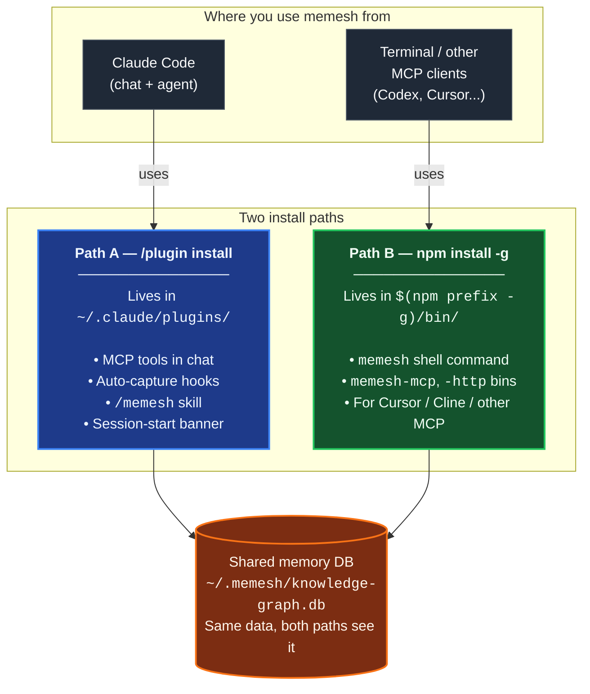

🌐 [English](README.md) | [繁體中文](README.zh-TW.md) | [Deutsch](README.de.md)

<p align="center">
  <h1 align="center">MeMesh</h1>
  <p align="center">
    <strong>Shared memory and durable local coordination for coding agents.</strong><br />
    One SQLite file. No Docker. No cloud required.
  </p>
  <p align="center">
    <a href="https://www.npmjs.com/package/@pcircle/memesh"></a>
    <a href="LICENSE"></a>
    <a href="https://nodejs.org"></a>
    <a href="https://modelcontextprotocol.io"></a>
  </p>
</p>

---

**MeMesh** is the open-source **local collaboration layer for AI coding agents**: shared memory, durable exact-recipient messaging, and governed memory-to-product proposals for Claude Code, Codex, Cursor, custom or Ollama-backed agents, and compatible local MCP clients. One SQLite file. No Docker. No cloud required.

### New collaboration surfaces

- `message` gives local agents a durable exact-recipient inbox with cursor recovery and explicit receipts over MCP, HTTP, and CLI.
- `message discover` gives agents a bounded, project-scoped live directory with session, principal, host kind, declared model/work (or explicit unknown), and active leases; it performs no message or receipt operation.
- `improvement` turns active memories into evidence-linked product-work proposals that agents can stage, but only a human can accept or reject.

## Install

**In Claude Code** — type these in the chat (hooks, memory tools and the `/memesh` skill are wired automatically):

```
/plugin marketplace add PCIRCLE-AI/memesh
/plugin install memesh@pcircle-memesh
```

Restart Claude Code. A `◉ MeMesh` status line at the top of your next session confirms the SessionStart hook emitted its status output.

**In a terminal** — the `memesh` CLI, the dashboard, and the `memesh-mcp` server for Codex / Cursor and compatible local MCP clients (needs [Node 22.13+](https://nodejs.org)):

```bash
npm install -g @pcircle/memesh
memesh doctor        # verifies this install end to end
```

Most Claude Code users eventually want **both** — they share one database and never conflict. Details, other agents, and upgrades: [Get Started](#get-started-in-60-seconds).

> **Installing via an AI agent?** Point it at [llms-install.md](llms-install.md) — deterministic steps with per-step verification. Once installed, [AGENTS.md](AGENTS.md) tells it how to use memesh well.

## The Problem

Your coding agent doesn't just forget facts between sessions — it **repeats work**. It re-proposes the approach you rejected last month, trips over the same failing test, re-discovers the constraint that broke production in March, and asks you to re-explain the architecture it helped design.

That's not a chat-history problem; it's an agent-memory problem. What needs to survive between sessions is the *work*: decisions with their reasons, failures with their fixes, and the links between them.

**MeMesh is that memory.** Hooks capture it from what the agent actually does (sessions, commits, failures — not manual notes), recall injects it at the moment the agent acts (session start, before file edits), and the knowledge-graph layer keeps it honest over time (supersession, LLM-judged conflict detection). Install with npm, memory lives in `~/.memesh/knowledge-graph.db`, plug into Claude Code or any MCP-compatible client.

> [!IMPORTANT]
> Actively developed — features may change between releases. [Open an issue](https://github.com/PCIRCLE-AI/memesh/issues) for bugs or feature requests.

---

## Local Agent Collaboration, Truthfully

MeMesh has a real cross-agent advantage: every host connected to the same local MeMesh instance can share durable memory, while the `message` tool provides an explicit exact-recipient messaging path over MCP, HTTP, and CLI.

The optional secure host-native wakeup runtime currently supports macOS and Linux. Core MeMesh memory, durable message storage, and MCP tools remain available on Windows; Windows host-native wakeup is not yet supported.

- Works today: an MCP, HTTP, or CLI sender can durably send one untrusted JSON-encoded payload of at most 65,536 UTF-8 bytes (64 KiB) to one named local recipient. A receiver can fetch it separately, resume from an opaque cursor after restart, and record intake, acknowledgement, workflow disposition, and host activation as separate facts.
- With the MeMesh Codex plugin enabled, each startup or resumed Codex thread registers automatically under a thread-scoped identity; no manual `agent setup` is required. An exact active session receives one bounded full message through its native queue without polling or a human reminder, and without a second inbox fetch. `memesh agent setup codex-session` remains available only when one workspace needs a stable named principal. The complete native envelope, including routing metadata and payload, is capped separately at 16,384 bytes (16 KiB). An exact-session send returns success only after that native queue accepts it; an oversized full envelope reports `native_message_too_large`, while other unavailable or rejected sessions report `recipient_unavailable`. Scoped recovery data remains durable. Principal targets retain durable store-and-forward behavior.
- A successful native admission (`host_accept`) means only that the local Codex queue accepted the bounded message. It does not mean an agent read it, acknowledged it, or accepted the work. Codex currently exposes message text only through its `--message` argument, so same-user process inspection may observe it while the queue command runs; keep native messages free of secrets.
- Durable message storage is bounded by owner policy, not silent deletion: `memesh message storage report` exposes logical payload, protected rows, reusable SQLite pages, and WAL size; bounded prune is dry-run by default and only tombstones old terminal payloads. An optional `MEMESH_AGENT_MESSAGE_STORAGE_QUOTA_BYTES` rejects a send atomically. See [bounded storage and audit retention](docs/platforms/agent-messaging.md#bounded-storage-and-audit-retention).
- A stopped, missing, or disconnected Codex session is not awakened or replaced. Its durable inbox remains available for audit and recovery; `poll` and `memesh message watch` are compatibility and diagnostic paths. Native delivery never resumes a stopped model session, executes a payload, or implies acknowledgement.
- Cooperative trust boundary: the recipient name is a logical routing ID, not a per-agent login or ACL. Every caller with access to the same local MeMesh instance must be treated as a trusted workspace participant; host adapters still enforce their own permissions and human-approval rules.
- Adapter boundary: the native wakeup described here is the configured local Codex-session path. Other local MCP loops can use the durable message operations their own host loop supports; this is not a universal host-support claim.

See [Local Agent Messaging Guide](docs/platforms/agent-messaging.md) for the exact lifecycle, capability boundary, support matrix, and remaining adapter work.

### Turn agent experience into reviewed product work

The `improvement` tool converts active memories and lessons into an evidence-linked product-improvement proposal instead of leaving valuable feedback buried in an inbox. Agents can propose and inspect status, but they cannot approve their own ideas. A human accepts or rejects through the existing review surfaces; acceptance preserves every source memory, links the reviewed work item back to its evidence, and makes it visible in future project briefings. This keeps learning actionable without quietly turning an agent suggestion into product policy.

---

## Install paths at a glance

MeMesh has **two install paths that coexist**. Most users want both. They write to the **same memory database** (`~/.memesh/knowledge-graph.db`), so memories captured in Claude Code chat appear in your shell, and vice versa.



**Which one do you need?**

| What you want to do | Install path |
|---|---|
| Use the `/memesh` skill inside a Claude Code conversation | Path A (plugin) |
| Get auto-capture (sessions → lessons → recall) in Claude Code | Path A (plugin) |
| Run `memesh remember` / `memesh recall` / `memesh doctor` in any terminal | Path B (npm-global) |
| Open the local dashboard via `memesh serve` (no `npx` lookup delay) | Path B (npm-global) |
| Plug `memesh-mcp` into Codex CLI, Cursor, or another local MCP client | Path B (npm-global) |
| All of the above | **Install both** — they don't conflict |

### ⚠️ Installing the plugin does NOT install the CLI

This is the most common confusion. Read this once and you'll save yourself the loop:

- `/plugin install memesh@pcircle-memesh` from inside Claude Code → installs **Path A only**. Gives you MCP tools, hooks, the `/memesh` skill. Does **NOT** put `memesh` on your shell `PATH`.
- `memesh reindex` / `memesh update` / `memesh doctor` typed in a normal terminal → needs **Path B** (npm-global). Without it: `zsh: command not found: memesh`.
- **Recommended setup for Claude Code users**: install **both**. They coexist, share the same database, never conflict.

```bash
# After /plugin install ..., also run this:
npm install -g @pcircle/memesh
```

If you only use memesh through Claude Code chat (never type `memesh` in a terminal), Path A alone is enough. Everyone else: install both.

---

## Get Started in 60 Seconds

### Option A — Claude Code plugin (one-line install)

If you use Claude Code, install MeMesh as a plugin from inside the CLI:

```
/plugin marketplace add PCIRCLE-AI/memesh
/plugin install memesh@pcircle-memesh
```

Claude Code wires hooks, skills, and the MCP server automatically. You get in-session auto-capture, proactive recall, the `/memesh` skill (remember / recall / learn / forget) inside the Claude Code conversation, and `remember` / `recall` / `forget` / `learn` available as MCP tools to the agent.

**Verify it:** restart Claude Code and start any session. A status line like `◉ MeMesh ready · no memories for "your-project" yet` appears at the top — this directly verifies SessionStart hook output. It does not by itself prove later capture or recall behavior. (Once you have memories, it shows counts instead.)

The MCP server runs directly from the plugin's bundled compiled output — no `npx` lookup, no build step, and nothing to compile. memesh stores its data through `node:sqlite`, which is part of Node itself (22.13+), so a Node upgrade cannot leave it with a binary built for the wrong runtime.

> **This installs the plugin only.** You can run CLI commands via `npx @pcircle/memesh <command>` if you absolutely don't want a global install, but typing plain `memesh` in a terminal will report `command not found`. To get a real shell `memesh` command, also run **Option B** below — both paths coexist and share the same memory database. The "Install paths at a glance" diagram above covers this.

### Option B — npm global (optional optimisation)

If you want the binary directly on your shell `PATH` (so plain `memesh`, `memesh-mcp`, etc. work in any terminal without the per-call `npx` lookup), or you want to expose `memesh-mcp` as a fixed-path stdio command to **non-Claude-Code MCP clients** (Codex CLI, Cursor, Cline, terminal-only flows):

```bash
npm install -g @pcircle/memesh
```

> **First-install notes (one-time):**
> - **No compiler needed** — the database engine is Node's own `node:sqlite`. `sqlite-vec`, which adds meaning-based search, ships as a prebuilt file for macOS (arm64/x64), Linux (x64/arm64) and Windows x64; on any other platform it is simply absent and recall stays on keyword search. Nothing here runs an install script, so `npm install --ignore-scripts` installs a fully working memesh.
> - **Semantic (meaning-based) search is optional** — the default recall path is FTS5 keyword search, which needs no model and no download. Meaning-based search needs an embedder: run [Ollama](https://ollama.com) locally, or configure a cloud embedder (see "Bring-your-own embeddings" below). Without one, memesh uses keyword search only.

### Step 1.5: Wire MeMesh into Claude Code (npm path only)

If you installed via **Option A** (`/plugin install memesh@pcircle-memesh`), skip this step — Claude Code wires plugin hooks automatically.

If you installed via **Option B** (`npm install -g`), the CLI is on your PATH — but nothing is wired into Claude Code yet: the npm package deliberately runs no install scripts, and the plugin (Option A) is what registers the MCP server and hooks inside Claude Code. What the npm path can wire by itself is the session hooks. Without them you can still use `memesh remember` / `recall` manually, but the **auto-capture loop** (sessions → lessons → recall on next session) is silent.

```bash
memesh setup                 # checks local host wiring and reports what it finds
```

Or the individual steps by hand:

```bash
memesh install-hooks         # adds memesh's hooks to ~/.claude/settings.json
memesh setup --check         # machine-level verification: reads the hosts' own config, changes nothing
```

The hooks coexist with any custom hooks you already have under `~/.claude/hooks/` — `install-hooks` writes additive entries and never overwrites yours. To remove later: `memesh uninstall-hooks`.

### Same memory from Codex CLI, Cursor, and other MCP clients

`memesh-mcp` is a plain stdio MCP server, so any MCP-capable host can talk to it — not just Claude Code. With Option B installed (`memesh-mcp` on your `PATH`), register it once per host:

```bash
# OpenAI Codex CLI — writes [mcp_servers.memesh] into ~/.codex/config.toml
codex mcp add memesh -- memesh-mcp

```

For Cursor, add the same stdio server to `~/.cursor/mcp.json` (global) or
`.cursor/mcp.json` (project-local):

```json
{
  "mcpServers": {
    "memesh": { "command": "memesh-mcp" }
  }
}
```

Every configured local host reads and writes the same `~/.memesh/knowledge-graph.db`, so a memory stored from one agent is recallable from Codex, Cursor, or another MCP client. Verify from the host by asking it to call the `recall` tool, or from a terminal:

```bash
codex mcp list       # memesh should be listed as enabled
```

> **Use `memesh-mcp`, not `npx -p @pcircle/memesh`, as the configured command.** `npx -p` resolves to the *local* package whenever the host's working directory is inside a checkout of this repository, silently running whatever state that working tree is in instead of the installed release.

### Native integration: Hermes Agent

**Hermes Agent** (NousResearch) has a first-party `MemoryProvider` plugin system — MeMesh integrates at the same tier as Hermes's own built-in memory backends (honcho, mem0, hindsight), not as an HTTP bridge. Unlike MCP mode where you manually call tools, Hermes's provider system runs `recall`/`remember` automatically on every turn.

The integration maps Hermes's `prefetch()` and `sync_turn()` hooks directly onto MeMesh's HTTP API. Complete guide with provider code structure, config, and four real pitfalls from a live deployment: **[docs/platforms/hermes-agent.md](docs/platforms/hermes-agent.md)**

### Native integration: OpenClaw

**OpenClaw** has a first-party memory-capability plugin system — MeMesh integrates as a native memory provider at the same tier as OpenClaw's own built-in backends (LanceDB), not as an HTTP bridge. The plugin registers via `api.registerMemoryCapability()` and exposes `memory_recall`/`memory_store`/`memory_forget` tools plus automatic recall on the `before_prompt_build` hook.

**Key difference from Hermes**: OpenClaw's auto-capture is threshold-gated (max 3 memories/turn when triggered), not every-turn. The integration maps onto MeMesh's HTTP API (`/v1/recall`, `/v1/remember`, `/v1/forget`). Full TypeScript plugin contract, config shape, and pitfalls: **[docs/platforms/openclaw.md](docs/platforms/openclaw.md)**

Current status: the source plugin is present under `extensions/memory-memesh/`, but it is not published or verified against a live OpenClaw runtime.

### Step 2: Store a decision

> The bash examples below assume `memesh` is on your `PATH` (Option B). Option A (plugin-only) users have two equivalent paths: ask in the Claude Code conversation (the `/memesh` skill + MCP tools cover the same flows), or replace `memesh` with `npx @pcircle/memesh` in any shell — same flags, no global install needed.

```bash
memesh remember "Use OAuth 2.0 with PKCE for the new auth"
```

Or use the explicit form when you want a stable name and type for later filtering:

```bash
memesh remember --name "auth-decision" --type "decision" --obs "Use OAuth 2.0 with PKCE"
```

### Step 3: Recall it later

```bash
memesh recall "login security"
# → Finds "OAuth 2.0 with PKCE" even though you searched different words
```

**That's it.** MeMesh is now remembering and recalling across sessions.

If you want to verify the install and local wiring end to end:

```bash
memesh doctor
```

Open the dashboard to explore your memory:

```bash
memesh serve
```

<p align="center">
  
</p>

<p align="center">
  
</p>

<p align="center">
  
</p>

### See what it remembered

At any moment, one command prints what your agent knows about the current project — where work was left off, decisions, lessons, recent activity (wrapped as reference data):

```bash
memesh briefing
```

```text
Where "your-project" was left off (today):
- Goal: Ship the payment retry logic
- Next: Open the PR once CI is green

Decisions and direction for "your-project":
- [decision] Use FTS5 as the retrieval baseline
```

This same block is what Claude Code receives automatically at session start, and what any other MCP client gets from the `briefing` tool — the agent starts oriented instead of re-reading the repository, and you stop re-explaining last week. The dashboard (`memesh serve`) is the full visual view. Generic `briefing` and SessionStart context has no recipient identity, so it does not report unread messages. To check an inbox, supply the exact `project` and `recipient`; MeMesh reports only that recipient's unfetched deliveries and directs the caller to poll before fetching each message.

### Your data

- **One local file.** Everything lives in `~/.memesh/knowledge-graph.db` — SQLite, on your disk. No cloud account; nothing leaves your machine unless you configure a cloud embedder or LLM yourself.
- **Back up = copy that one file.** Restore = copy it back.
- **Pause capture anytime**: `export MEMESH_AUTO_CAPTURE=false`.
- **Delete everything**: remove `~/.memesh/`.

---

## Who Is This For?

| If you are... | MeMesh helps you... |
|---------------|---------------------|
| **A developer using Claude Code** | Auto-recall project decisions, file-specific lessons, and past failures as you work |
| **A coding-agent power user** | Share one local memory layer and a truthful local inbox pattern across MCP-compatible tools |
| **An individual using Codex, Cursor, Claude Code, or another MCP client** | Use one local memory layer across agents and sessions, and coordinate handoffs through the shared store |
| **A developer integrating an agent** | Add local memory through MCP, HTTP, or the CLI |

---

## Designed For Coding Agents First

<table>
<tr>
<td width="33%" align="center">

**Claude Code / Desktop**
```bash
memesh-mcp
```
MCP tools + Claude Code hooks

</td>
<td width="33%" align="center">

**Any HTTP Client**
```bash
curl localhost:3737/v1/recall \
  -H "Content-Type: application/json" \
  -d '{"query":"auth"}'
```
`memesh serve` (REST API)

</td>
<td width="33%" align="center">

**Any LLM (OpenAI format)**
```bash
memesh export-schema \
  --format openai
```
Paste tools into any API call

</td>
</tr>
</table>

---

## Why Not OpenMemory, Cursor Memories, Mem0, Or Zep?

| | **MeMesh** | OpenMemory | Cursor Memories | Mem0 | Zep / Graphiti |
|---|---|---|---|---|---|
| **Best fit** | Local memory for coding agents | Local/cross-client MCP memory | Cursor-native project memory | Managed app/agent memory | Temporal knowledge graphs |
| **Install shape** | `npm install -g @pcircle/memesh` | Local app/server flow | Built into Cursor | Cloud API / SDK / MCP | Service/framework setup |
| **Storage** | One local SQLite file | Local memory stack | Cursor-managed rules/memories | Hosted or self-hosted stack | Graph database |
| **Cloud required** | No | No for local mode | Depends on Cursor account/settings | Yes for platform | Usually yes/self-hosted |
| **Claude Code hooks** | First-class | MCP tools | No | MCP tools | Not Claude Code-specific |
| **Dashboard** | Built in | Built in | Cursor settings | Platform dashboard | Platform/graph tooling |
| **Tradeoff** | Simple local wedge, not enterprise scale | Broader local app footprint | Locked to Cursor | Strong managed platform, less local-first | Strong graph model, heavier setup |

**MeMesh trades enterprise-scale managed infrastructure for instant local setup, inspectable storage, and coding-agent workflow hooks.**

---

## Benchmarks — 95.60% R@5 on LongMemEval-S

MeMesh's retrieval is **FTS5 alone** — no LLM, no embeddings on the hot path. Measured against the public [LongMemEval-S](https://huggingface.co/datasets/xiaowu0162/longmemeval) benchmark (500 questions, MIT-licensed):

| System | R@5 | Source |
|---|---|---|
| **MeMesh (Mode A, via `recallEnhanced()`)** | **95.60%** | [benchmarks/longmemeval/RESULTS.md](benchmarks/longmemeval/RESULTS.md) |
| MemPalace | 96.6% | Vendor self-report |
| Supermemory | ~82% | Vendor estimate |
| Zep | 63.8% | LongMemEval paper |
| Mem0 | 49.0% | LongMemEval paper |

Re-runnable in ~10 seconds. Full instructions, dataset SHA256, raw per-question results, and known-failure analysis: [`benchmarks/longmemeval/REPRODUCE.md`](benchmarks/longmemeval/REPRODUCE.md).

---

## What Happens Automatically In Claude Code

You don't need to manually remember everything. MeMesh has **9 hooks** that capture and inject knowledge while you work:

| When | What MeMesh does |
|------|------------------|
| **Every session start** | Loads your most relevant memories + proactive warnings from past lessons |
| **Before editing files** | Recalls memories tied to the file or project before Claude writes code |
| **When you ask to remember** | Detects "remember this" / "guardar en memesh" / "sauvegarder dans memesh" / "記下來" intent (5 languages) and reminds Claude to use memesh |
| **After every `git commit`** | Records what you changed, with diff stats |
| **After a plan is approved or you answer a question** | Reminds Claude to `remember` the decision if it's worth keeping (once per tool per session) |
| **When Claude stops** | Captures files edited, errors fixed, and auto-generates structured lessons from failures |
| **Before context compaction** | Saves knowledge before it's lost to context limits |
| **Before risky commands and edits** | Fires the lesson-guards you accepted — a warning at the exact moment a recorded mistake is about to repeat |
| **When an opted-in Codex session starts or resumes** | Registers that exact live thread for bounded full-message native delivery; other workspaces and stopped sessions are not attached |

> **Opt out anytime:** `export MEMESH_AUTO_CAPTURE=false`

---

## Configuration

All configuration is via environment variables. Defaults are local-only and zero-network — you don't need to set anything to get a working system.

| Variable | Default | What it does |
|---|---|---|
| `MEMESH_DB_PATH` | `~/.memesh/knowledge-graph.db` | Override the SQLite database location. |
| `MEMESH_AUTO_CAPTURE` | `true` | Disable the auto-capture hooks (`Stop`, `PreCompact`) entirely. |
| `MEMESH_AUTO_DETECT_LLM` | unset (auto-detect **on**) | Set to `0` to stop memesh using an API key it finds in your shell env. By default, if `ANTHROPIC_API_KEY` / `OPENAI_API_KEY` / `OLLAMA_HOST` is set and you have not configured a provider in `~/.memesh/config.json`, memesh uses it for write-side LLM features (lesson extraction, auto-tagging, dream). Embeddings are unaffected — they stay keyword-only (FTS5) unless you explicitly set `embedder.provider` to `ollama` or `openai`. |
| `MEMESH_AUTO_UPDATE` | `off` | Auto-update policy. `off` (default) never auto-updates; `patch` allows `X.Y.Z → X.Y.Z+N`; `minor` adds `X.Y.Z → X.Y+1.0`; `major` allows any bump. When permitted, a detached `npm install -g` fires at session end (Stop hook) so it never blocks your work — outcomes land in `~/.memesh/auto-update.log`. Also settable as `autoUpdate` in `~/.memesh/config.json` (env wins). A maintainer deprecation warning never overrides `off`: update manually or choose a policy that permits the bump. |
| `OPENAI_API_KEY` | unset | Your OpenAI key. Used automatically for LLM features unless you set `MEMESH_AUTO_DETECT_LLM=0` or configure a provider explicitly. |
| `OLLAMA_HOST` | `http://localhost:11434` | Override the Ollama endpoint when using a local Ollama provider. |

`memesh doctor` prints the resolved configuration so you can see what's active.

**Fallback LLM providers (Smart Mode).** In the dashboard **Settings → "Fallback providers"** you can set an ordered failover chain — memesh tries each provider in turn when your primary is down. Add a local [Ollama](https://ollama.com) fallback, or a cloud one (OpenAI / Anthropic, with an API key). Privacy tradeoff: when a cloud fallback is used, memory text — which can be private — is sent to that provider, so it matters if you run local-only for privacy.

When npm flags an installed version as deprecated (typically a security advisory), the next session-start prepends a strong `⚠️ MeMesh <ver> is DEPRECATED` banner and `memesh update-status` surfaces the same line until you upgrade. The check is cached at `~/.memesh/update-check.<version>.json` so a transient network failure can't dim the warning.

---

## Dashboard

5 tabs, 11 languages, zero external dependencies. Access at `http://localhost:3737/dashboard` when the server is running.

| Tab | What you see |
|-----|-------------|
| **Home** | What memesh did for you — dreamer insights lead: weekly recaps and pattern proposals with one-click accept/reject; the full analytics stack (Memory Health Score, 30-day timeline, PM velocity + KG connectivity, work patterns) folds into an on-demand expander |
| **Memories** | The whole library behind one surface — instant filter plus Enter for server-ranked search (full-text + vector), scope chips for the work layer (goals/decisions/lessons/plans) vs evidence vs all vs archived, a cluster composition bar, per-row expandable detail (lessons keep their structured error/root-cause/fix/prevention view), archive/restore inline |
| **Project** | One project's history — the roadmap view (phases, milestones, key lessons) behind a project selector |
| **Graph** | Interactive force-directed knowledge graph with type filters, search, ego mode, recency heatmap |
| **Settings** | LLM provider config, instant language selector |

---

## Smart Features

**🧠 Smart Search** — Search "login security" and find memories about "OAuth PKCE". MeMesh uses FTS5 + sqlite-vec on the hot path, LLM-free, and the vector supplement still reaches across related wording.

**🌏 Search in scripts that don't use spaces** — Chinese, Japanese, Korean, Thai, Lao, Khmer and half-width katakana are indexed as overlapping character pairs, so a memory written as 「資料庫遷移前一定要先備份」 is found by searching 「備份」 — not only by its exact full text. Text is normalised (NFC) on both the write and the query side, so memories typed on macOS or with a Korean or Vietnamese IME are found in either spelling.

**📊 Scored Ranking** — Results ranked by relevance (30%) + recency (25%) + frequency (18%) + confidence (17%) + recall impact (10%).

**🔄 Knowledge Evolution** — Decisions change. `forget` archives old memories (never deletes). `supersedes` relations link old → new. Your AI always sees the latest version.

**⚠️ Conflict Detection** — `memesh dream conflicts` has the LLM judge your semantically-closest memory pairs for contradiction, supersession or duplication, and stages what it finds as proposals. Nothing applies itself: you review with `dream list` / `dream show`, and only an accepted proposal creates the relation — after which every `recall` touching either memory carries the warning. Causality is never inferred from timestamps; verdicts come from what the memories actually say.

**🕸️ Knowledge Graph Connectivity** — `memesh kg backfill-relations --all-rules` links orphan entities using tag co-occurrence, project clustering, session context, and name similarity — no LLM required.

**📦 Personal backup and migration** — `memesh export > memesh-backup.json` → copy it to another machine → `memesh import memesh-backup.json`
Imported bundles stay searchable, but MeMesh does not auto-inject imported memories into host context until you review or re-store them locally.

---

## Example Usage

> "MeMesh remembered that we chose PKCE over implicit flow three weeks ago. When I asked Claude about auth again, it already knew — no re-explaining needed."
> — **Solo developer, building a SaaS**

> "I stored a decision from Claude Code and recalled it from Codex the next day. The same local memory followed my work instead of one agent."
> — **Solo developer using multiple coding agents**

> "The dashboard showed me that 90% of my memories were auto-generated session logs. I started using `remember` deliberately for architecture decisions. Game changer."
> — **Developer who discovered the analytics panel**

---

## Recipes

### Catch a contradiction before it bites

Two decisions, made weeks apart, that cannot both be true — the failure mode
a memory layer exists to catch:

```bash
memesh remember --name retry-policy --type decision \
  --obs "All HTTP clients retry failed requests up to 5 times with exponential backoff."
# ...weeks later, someone decides the opposite...
memesh remember --name retry-policy-v2 --type decision \
  --obs "HTTP clients must never retry automatically — fail fast and surface the error."

memesh dream conflicts        # the judge flags the pair, with its reasoning
memesh dream show 1           # read the verdict, the excerpts, what accepting creates
memesh dream accept 1         # YOU decide — nothing is ever linked automatically
memesh recall "retry policy"  # → Warning: Conflicts detected
```

From then on, any assistant that recalls either decision is told they
conflict — instead of confidently quoting whichever one it found first.

### One memory, three assistants

MeMesh is an MCP server, so the same SQLite file serves every MCP client on
the machine. Register it once per tool (exact commands in
[Get Started](#get-started-in-60-seconds)) and a decision recorded in Claude
Code is recalled by Codex or another configured local MCP client mid-session — no re-explaining, no
copy-pasting context between vendors.

### Record decisions so they stay findable

Auto-capture keeps session history, but the memories that pay rent are the
deliberate ones:

```bash
memesh remember --name auth-approach --type decision \
  --obs "JWT with RS256; PKCE over implicit flow because the client is public." \
  --tags "project:myapp" "topic:auth"
```

Then link consequences to their causes as they happen — from any MCP client,
in plain words: *"remember this incident as a lesson, influenced by
auth-approach"*. The `remember` tool takes free-form relations, and `caused` /
`influenced` are the documented causal vocabulary (cause → effect, stated
explicitly — MeMesh never infers causality from timestamps). Weeks later,
`memesh recall "why did we pick PKCE"` returns the decision with its recorded
consequences attached — reasoning you can follow, not just text that matched.

---

## Unlock Smart Mode (Optional)

MeMesh works offline by default — recall stays strictly LLM-free (95.60% R@5 on LongMemEval-S out of the box). Add an LLM API key only if you want LLM-augmented analysis flows on top: smarter session extraction, auto-tagging of new memories, lesson generation from failures, and `dream` compression:

```bash
memesh config set llm.provider anthropic
memesh config set llm.api-key sk-ant-...
```

Or use the dashboard Settings tab (visual setup):

```bash
memesh serve  # opens dashboard → Settings tab
```

**Mine your past sessions into memory.** `memesh dream run --from-transcripts` reads this project's Claude Code session transcripts, asks the LLM for the decisions and lessons buried in the conversation, and stages them as proposals — nothing enters your graph automatically. Review each with `memesh dream show <id>` and accept the ones worth keeping. To run it on a schedule, enable `memesh config set transcriptMining true` and point a cron/launchd entry at `memesh dream run --from-transcripts --if-due` — it self-throttles (default once every 24h per project) and stays staging-only. See [API_REFERENCE](docs/api/API_REFERENCE.md#memesh-dream).

### Semantic search / embeddings (optional)

By default MeMesh does **keyword-only** recall (FTS5) — no API key, no model download, nothing leaves your machine. Semantic (meaning-based) search is opt-in and needs an embedder. Point one of these at it:

```bash
memesh config set embedder.provider ollama          # local, needs `ollama serve`
# or, for a hosted embedder:
memesh config set embedder.provider openai
```

The embedder is configured **independently of the chat LLM** — changing `llm.provider` never silently changes your embeddings. Each provider pins its own model and width (`ollama` → nomic-embed-text at 768, `openai` → text-embedding-3-small at 1536); the model is not separately selectable, because a vector index is fixed at one width and a second model would put vectors from a different embedding space into it.

If you switch to an embedder with a different dimension (e.g. 768 → 1536), **nothing is deleted**. MeMesh keeps the existing index and tells you on open to run `memesh reindex`, which builds the new index beside the old one and switches over only once every memory has a vector — so an interrupted rebuild costs you nothing and resumes where it stopped. During that window semantic search is off and recall runs on keyword search alone; `recall` reports this as `degraded` rather than implying it searched. Supported `embedder.provider` values: `ollama` (local), `openai` (hosted). With none set, recall stays on keyword search.

| | Level 0 (default) | Level 1 (Smart Mode) |
|---|---|---|
| **Search** | FTS5 + sqlite-vec, 95.60% R@5 | unchanged — recall is LLM-free at every level |
| **Auto-capture** | Rule-based patterns | + LLM extracts decisions & lessons |
| **Auto-tagging** | Manual tags only | + LLM generates tags for new memories |
| **Failure analysis** | Not available | + LLM converts session errors into structured lessons |
| **Compression** | Not available | `dream` compress verbose memories |
| **Cost** | Free, no API key | ~$0.0001 per analysis call (Haiku) |

---

## All 12 Memory and Coordination Tools

| Tool | What it does |
|------|-------------|
| `work_package` | Prepare one bounded, calendar-selected untrusted digest package; submit one strictly validated digest for pending human review, or defer without durable change. Agents cannot apply or reject it; package hashes identify freshness, not authentication |
| `remember` | Store knowledge with observations, relations, and tags |
| `recall` | FTS5 + sqlite-vec search with multi-factor scoring (relevance, recency, frequency, confidence, recall impact) — no LLM in the hot path |
| `forget` | Soft-archive (never deletes) or remove specific observations |
| `export` | Back up, migrate, or move memories as JSON between compatible agents |
| `import` | Import memories with merge strategies (skip / overwrite / append) |
| `learn` | Record structured lessons from mistakes (error, root cause, fix, prevention) |
| `task_state` | Read or record where the work stands — goal, next step, blocker, what was just finished |
| `briefing` | The assembled work topology for any MCP client; generic context stays quiet, while exact `project` + `recipient` can surface only that recipient's unfetched deliveries |
| `user_patterns` | Analyze your work patterns — schedule, tools, strengths, learning areas |
| `improvement` | Stage an evidence-linked product improvement for human review, or read its status; agents cannot accept or reject it |
| `message` | Discover live agents, then exchange exact-recipient untrusted messages. Durable JSON payload max: 64 KiB; complete native envelope max: 16 KiB with distinct `native_message_too_large` and `recipient_unavailable` failures. Native acceptance, discovery, poll, and fetch never imply acknowledgement or disposition |

---

## Architecture

```
                    ┌─────────────────┐
                    │   Core Engine   │
                    │   operations    │
                    └────────┬────────┘
           ┌─────────────────┼─────────────────┐
           │                 │                 │
     CLI (memesh)    HTTP API (serve)    MCP (memesh-mcp)
           │                 │                 │
           └─────────────────┼─────────────────┘
                             │
                    SQLite + FTS5 + sqlite-vec
                    (~/.memesh/knowledge-graph.db)
```

Core is framework-agnostic. Same logic runs from terminal, HTTP, or MCP.

---

## Upgrading

Claude Code's plugin marketplace pins versions at install time and does **not** auto-update. To pick up a new release:

**Option A — `/plugin` UI**: uninstall `memesh@pcircle-memesh`, then reinstall. Claude Code fetches the latest marketplace version.

**Option B — one command** (no UI clicking, idempotent; requires the npm CLI, `npm install -g @pcircle/memesh`):

```bash
memesh upgrade-plugin
```

It finds your installed plugin version, checks the prerequisites, and runs the bundled upgrade script for you. Prerequisites: `node`, `npm` and `rsync` on your PATH (macOS ships rsync; Debian/Ubuntu: `sudo apt install rsync`).

Plugin-only users without the npm CLI can still run the script by hand — substitute your installed version into the path:

```bash
bash ~/.claude/plugins/cache/pcircle-memesh/memesh/<current-version>/scripts/upgrade-plugin.sh

# Installs from before v4.2.5 don't contain the script yet; use the
# npm-global copy instead (see "Install paths at a glance" above):
bash "$(npm prefix -g)/lib/node_modules/@pcircle/memesh/scripts/upgrade-plugin.sh"
```

The script fast-forwards the marketplace cache, stages the new version under `~/.claude/plugins/cache/`, installs runtime deps, and re-points `installed_plugins.json`. Restart Claude Code afterwards so the MCP server reconnects.

**npm-global installs** (`npm install -g @pcircle/memesh`) can self-update via `memesh update`. For a source checkout, with npm installed, run `git pull && npm install && npm run build`.

**Codex plugin marketplace installs** (using the Codex CLI):

```bash
codex plugin marketplace add PCIRCLE-AI/memesh
codex plugin add memesh@pcircle-memesh
```

For a stale marketplace snapshot, refresh it with `codex plugin marketplace upgrade pcircle-memesh`, then reinstall with `codex plugin remove memesh` followed by `codex plugin add memesh@pcircle-memesh`.

Session start surfaces a one-line banner (throttled to once per 24h per version) when a newer release is available, and `memesh doctor` reports the upgrade target with the channel-specific command.

---

## Contributing

```bash
git clone https://github.com/PCIRCLE-AI/memesh
cd memesh && npm install && npm run build
npm test
npm run test:e2e-dashboard
```

Dashboard: `cd dashboard && npm install && npm run dev`

---

<p align="center">
  <strong>MIT</strong> — Made by <a href="https://pcircle.com">PCIRCLE AI</a>
</p>
