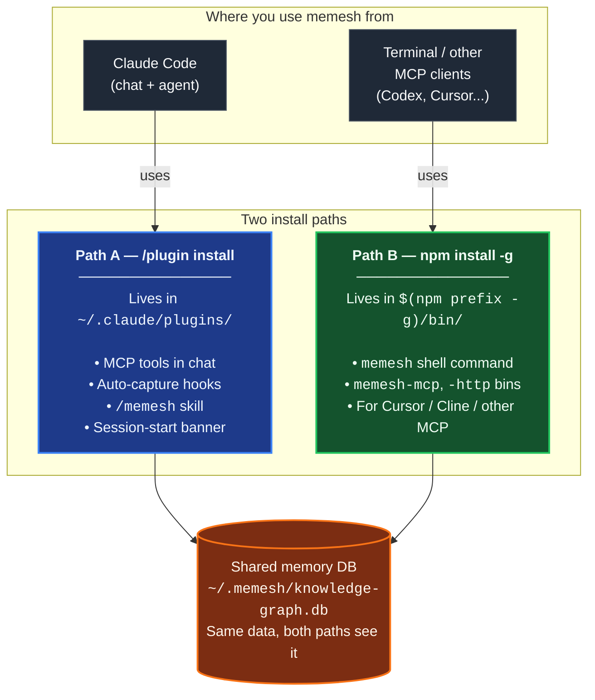

🌐 [English](README.md) | [繁體中文](README.zh-TW.md) | [Deutsch](README.de.md)

<p align="center">
  <h1 align="center">MeMesh</h1>
  <p align="center">
    <strong>給程式開發代理的共享記憶與耐久化本機協作層。</strong><br />
    一個 SQLite 檔案。不需要 Docker。不需要雲端。
  </p>
  <p align="center">
    <a href="https://www.npmjs.com/package/@pcircle/memesh"></a>
    <a href="LICENSE"></a>
    <a href="https://nodejs.org"></a>
    <a href="https://modelcontextprotocol.io"></a>
  </p>
</p>

---

**MeMesh** 是給 AI 程式開發代理用的**開源本機協作層**：讓 Claude Code、Codex、Cursor、自訂代理與相容的本機 MCP 用戶端共享記憶、交換耐久化單一收件人訊息，並把有價值的經驗轉成受治理的產品改善提案。全部存在一個 SQLite 檔案裡，不需要 Docker，也不需要雲端。

### 新的協作入口

- `message` 讓本機 agent 擁有可恢復 cursor、可明確記錄 receipt 的單一收件人耐久化 inbox，MCP、HTTP、CLI 三個 surface 都可用。
- `message discover` 提供有界、限定 project 的活動 agent directory，回傳 session、principal、host kind、宣告的 model/work（或明確 unknown）與 active lease；不會進行訊息或 receipt 操作。
- `improvement` 讓 active memories 直接進入有證據連結的產品工作提案；agent 能發起與查狀態，但只有人類能接受或拒絕。

## 安裝

**在 Claude Code 裡** — 在對話框輸入這兩行（hooks、記憶工具和 `/memesh` skill 會自動接好）：

```
/plugin marketplace add PCIRCLE-AI/memesh
/plugin install memesh@pcircle-memesh
```

重開 Claude Code。下一個 session 開頭出現 `◉ MeMesh` 狀態列，代表 SessionStart hook 已輸出狀態列。

**在終端機裡** — `memesh` CLI、儀表板，以及給 Codex / Cursor 與相容本機 MCP 用戶端用的 `memesh-mcp` server（需要 [Node 22.13+](https://nodejs.org)）：

```bash
npm install -g @pcircle/memesh
memesh doctor        # 端到端驗證這份安裝
```

多數 Claude Code 使用者兩種都會裝。它們共用同一個資料庫，不會互相干擾。想知道細節、其他代理怎麼接、怎麼升級，看下面的「60 秒快速開始」。

## 問題所在

你的代理換一次對話就忘光，這還不是最糟的。最糟的是它會**把做過的事再做一次**：

- 重新提議你上個月否決掉的做法
- 再一次被同一個測試絆倒
- 重新「發現」三月那條弄壞 production 的限制
- 要你重講一遍當初它也有份設計的架構

這不是「聊天記錄沒存好」的問題。要留下來的不是對話，是*工作本身*——做過什麼決定、為什麼那樣決定、哪裡失敗過、後來怎麼修的，以及這些事情之間的關係。

**MeMesh 補的就是這一塊。** 它做三件事：

- **自動記下來**：hooks 從代理真正做過的事情擷取——session、commit、失敗，不用你手動寫筆記
- **在需要的時候送回去**：session 開始時、要改檔案之前，把相關記憶放進代理眼前
- **不讓記憶爛掉**：用明確的關係標出取代、矛盾與因果，讓知識圖譜維持可信

用 npm 裝，記憶放在 `~/.memesh/knowledge-graph.db`，接上 Claude Code 或任何支援 MCP 的用戶端就能用。

> [!IMPORTANT]
> **持續開發中的專案** — 功能會持續更新，版本之間可能會有變動。執行 `memesh feedback --bug`、`--feature` 或 `--question`，先準備一份可供檢查的公開 issue 草稿。

---

## Local Agent Collaboration，要說真話

MeMesh 有一個很強的跨代理優勢：凡是連到同一個本機 MeMesh instance 的 host，都能共享持久化記憶；`message` tool 則提供 MCP、HTTP 與 CLI 共用的明確單一收件人訊息路徑。

可選的安全 host-native 喚醒 runtime 目前支援 macOS 與 Linux。Windows 仍可使用 MeMesh 核心記憶、耐久化 message storage 與 MCP tools；Windows host-native 喚醒目前尚未支援。

- 今天就能做的：MCP、HTTP 或 CLI sender 可把一份 JSON 編碼後不超過 65,536 UTF-8 bytes（64 KiB）的不受信任 payload 耐久化送給一個指定的本機 recipient。接收端可另行擷取、在重啟後用 opaque cursor 補收，並把 intake、acknowledgement、workflow disposition 與 host activation 分開記錄。
- 啟用 MeMesh Codex plugin 後，每個新啟動或恢復的 Codex thread 都會自動以 thread-scoped identity 註冊，不需要手動執行 `agent setup`。確切活動中的 session 可在沒有輪詢或人工提醒下透過原生 queue 收到一則完整訊息，也不需要再次 fetch inbox；只有某個 workspace 需要穩定的命名 principal 時，才需選用 `memesh agent setup codex-session`。包含 routing metadata 與 payload 的完整 native envelope 另有 16,384 bytes（16 KiB）上限。exact-session send 只有在原生 queue 接受後才成功；完整 envelope 過大時回報 `native_message_too_large`，其他無法使用或拒絕的 session 則回報 `recipient_unavailable`。scope 相符的 recovery data 仍會保留，Principal target 在無法原生傳遞時仍保有 durable store-and-forward。
- 成功的原生 admission（`host_accept`）只代表本機 Codex queue 接受了這則有界訊息；它不代表 agent 已讀、已確認收到，或接受了工作。Codex 目前只提供 `--message` 參數傳入文字，因此同一使用者的 process inspection 可能在 queue command 執行期間看到內容；原生訊息不要放 secrets。
- Durable message storage 由 owner policy 控制，不會偷偷刪除未解決訊息：`memesh message storage report` 會顯示 logical payload、protected rows、可重用 SQLite pages 與 WAL 大小；bounded prune 預設只 dry-run，且只 tombstone 舊的 terminal payload。可選的 `MEMESH_AGENT_MESSAGE_STORAGE_QUOTA_BYTES` 會在交易內原子拒絕超額 send。詳見 [bounded storage and audit retention](docs/platforms/agent-messaging.md#bounded-storage-and-audit-retention)。
- 已停止、缺失或斷線的 Codex session 不會被喚醒或取代。它的耐久化 inbox 仍可供稽核與復原；`poll` 與 `memesh message watch` 是相容與診斷路徑。原生傳遞不會自動恢復已停止的模型 session、不會執行 payload，也不代表已確認收到。
- 協作式信任邊界：recipient 名稱只是邏輯 routing ID，不是每個 agent 各自登入的身分或 ACL。能存取同一本機 MeMesh instance 的 caller 都必須視為受信任的 workspace participant；host adapter 仍需自行落實權限與人工核准規則。
- Adapter 邊界：這裡的原生喚醒只指已設定的本機 Codex-session 路徑。其他本機 MCP loop 可使用自己 host loop 支援的耐久化 message 操作；這不是通用 host 支援宣告。

完整 lifecycle、現況邊界、支援矩陣和剩餘 adapter 工作，請看 [Local Agent Messaging Guide](docs/platforms/agent-messaging.md)。

### 把 agent 經驗轉成受審核的產品工作

`improvement` tool 能把仍有效的記憶與教訓轉成有證據連結的產品改善提案，不再讓有價值的 feedback 只停在 inbox。Agent 可以提案與查狀態，但不能核准自己的建議；人類透過既有 review surface 接受或拒絕。接受後，MeMesh 會保留全部來源記憶、把工作項目連回證據，並讓它出現在後續 project briefing。這讓學習真正進入產品流程，同時避免 agent 建議在沒有人工授權下直接變成產品政策。

---

## 安裝路徑一覽

MeMesh 有**兩條會共存的安裝路徑**。多數使用者兩條都需要。它們寫入**同一份記憶資料庫**（`~/.memesh/knowledge-graph.db`），所以 Claude Code 對話裡記下的東西在 terminal 也看得到，反之亦然。



**你需要哪一條？**

| 你想做什麼 | 安裝路徑 |
|---|---|
| 在 Claude Code 對話裡用 `/memesh` skill | Path A（plugin）|
| 在 Claude Code 自動 capture（session → 教訓 → 下次 recall）| Path A（plugin）|
| 在任何 terminal 跑 `memesh remember` / `memesh recall` / `memesh doctor` | Path B（npm-global）|
| 用 `memesh serve` 直接開 dashboard（沒有 `npx` 啟動延遲）| Path B（npm-global）|
| 在 Codex CLI 使用 MCP 工具 | Codex plugin（零設定），或用 Path B 手動註冊 |
| 把 `memesh-mcp` 接到 Cursor、Cline 或其他 MCP client | Path B（npm-global）|
| 以上都要 | **兩條都裝** — 不會衝突 |

> **常見誤會（小心踩雷）**：Claude Code 的 plugin **不會** 把 `memesh` 放到你的 shell `PATH` 上。如果你只跑 `/plugin install`，然後在 terminal 打 `memesh reindex`，你會看到 `command not found`。這是正常的 — 還要加 `npm install -g @pcircle/memesh` 才有 shell 指令。

### ⚠️ 裝 plugin 不會裝 CLI

這個是最常見的踩坑點，讀一次省下未來的循環：

- 從 Claude Code 跑 `/plugin install memesh@pcircle-memesh` → 只裝 **Path A**。給你 MCP 工具、hooks、`/memesh` skill。**不會**把 `memesh` 放到你的 shell `PATH`。
- 在 terminal 打 `memesh reindex` / `memesh update` / `memesh doctor` → 需要 **Path B**（npm-global）。沒裝就會 `zsh: command not found: memesh`。
- **Claude Code 使用者建議的安裝方式**：**兩條都裝**。共存、共用同一份資料庫、不衝突。

```bash
# 跑完 /plugin install ... 之後，再跑這個：
npm install -g @pcircle/memesh
```

如果你只透過 Claude Code 對話用 memesh（從不在 terminal 打 `memesh`），Path A 自己就夠了。其他人請兩條都裝。

---

## 60 秒快速開始

### 選項 A — Claude Code 外掛（一行安裝）

如果你使用 Claude Code，從 CLI 內把 MeMesh 當外掛安裝：

```
/plugin marketplace add PCIRCLE-AI/memesh
/plugin install memesh@pcircle-memesh
```

Claude Code 會自動接好 hooks、skills 和 MCP server。你會獲得對話內自動擷取、主動回憶、可在 Claude Code 對話中使用的 `/memesh` skill（remember / recall / learn / forget），以及代理可呼叫的 `remember` / `recall` / `forget` / `learn` MCP 工具。

**驗證方式：**重開 Claude Code、開任何 session。開頭出現像 `◉ MeMesh ready · no memories for "your-project" yet` 的狀態列 — 這直接驗證 SessionStart hook 有輸出；單憑這一行不能證明後續 capture 或 recall 已運作。（有記憶之後會改顯示數量。）CLI 與本地儀表板無需任何額外的全域安裝就能完整使用 — `npx @pcircle/memesh <command>` 可執行所有 CLI 指令，`npx @pcircle/memesh` 可在 `localhost:3737` 啟動儀表板。MCP server 直接從外掛內建的編譯產物啟動 — 不需要 `npx` 查找、不需要 `npm install -g`、不需要本地建置步驟。memesh 透過 Node 內建的 `node:sqlite`（22.13+）存放資料，所以升級 Node 不會留下一個為錯誤 runtime 編譯的二進位檔。

### 選項 B — npm 全域安裝（可選最佳化）

如果你希望二進位執行檔直接放在 shell `PATH` 上（讓 `memesh`、`memesh-mcp` 等指令能在任何終端機直接執行，省去每次呼叫的 `npx` 查找），或想將 `memesh-mcp` 以固定路徑的 stdio 指令暴露給未使用 Claude 或 Codex plugin 的 MCP 用戶端（Cursor、Cline、純終端機流程）：

```bash
npm install -g @pcircle/memesh
```

> **首次安裝注意事項（一次性）：**
> - **不需要編譯器** — 資料庫引擎就是 Node 自己的 `node:sqlite`，回憶使用內建的 FTS5 全文索引。這裡沒有任何東西會執行安裝腳本，所以 `npm install --ignore-scripts` 也能裝出完全可用的 memesh。

### 第一步半：把 MeMesh 接進 Claude Code（僅 npm 路徑需要）

如果你透過**選項 A**（`/plugin install memesh@pcircle-memesh`）安裝，請略過此步驟 — Claude Code 會自動接好外掛 hooks。

如果你透過**選項 B**（`npm install -g`）安裝，CLI 已在 PATH 上 — 但**還沒有任何東西接進 Claude Code**：npm 套件刻意不執行安裝腳本，把 MCP server 和 hooks 接進 Claude Code 的是外掛（選項 A）。npm 路徑自己能接的是 session hooks。沒有這些 hooks 還是可以手動使用 `memesh remember` / `recall`，但**自動擷取迴路**（session → 教訓 → 下次 session 主動回憶）就會靜默不動。

```bash
memesh setup                 # 檢查本機 host 接線並回報結果
```

或手動逐步：

```bash
memesh install-hooks         # 把 memesh hooks 加進 ~/.claude/settings.json
memesh setup --check         # 機器層級驗證：讀各主機自己的設定，什麼都不改
```

這些 hooks 會跟你既有的 `~/.claude/hooks/` 自訂 hooks 共存 — `install-hooks` 用追加方式寫入，從不覆寫你的東西。要移除：`memesh uninstall-hooks`。

### 從 Codex CLI、Cursor 與其他 MCP 用戶端使用同一份記憶

Codex plugin marketplace 安裝會自動宣告內建的 MCP server；它直接從 plugin cache 啟動 `dist/mcp/server.js`，不需要全域安裝，也不需要手動執行 `codex mcp add`：

```bash
codex plugin marketplace add PCIRCLE-AI/memesh
codex plugin add memesh@pcircle-memesh
```

`memesh-mcp` 也是標準的 stdio MCP server，任何支援 MCP 的主機都能用。裝好選項 B（`memesh-mcp` 在 `PATH` 上）之後，每個主機註冊一次；對 Codex 而言，這是 plugin 以外的手動替代方案：

```bash
# OpenAI Codex CLI — 會把 [mcp_servers.memesh] 寫進 ~/.codex/config.toml
codex mcp add memesh -- memesh-mcp

```

Cursor 請將同一個 stdio server 加入 `~/.cursor/mcp.json`（全域），或專案內的 `.cursor/mcp.json`：

```json
{
  "mcpServers": {
    "memesh": { "command": "memesh-mcp" }
  }
}
```

每個已設定的本機 host 讀寫的都是同一個 `~/.memesh/knowledge-graph.db`，所以在任何代理儲存的記憶，Codex、Cursor 和其他 MCP 用戶端都能回憶得到。請從主機要求它呼叫 `recall` 工具驗證：

```bash
codex mcp list       # memesh 應顯示為 enabled
```

> **設定的指令要用 `memesh-mcp`，不要用 `npx -p @pcircle/memesh`。**當主機的工作目錄在這個 repo 的 checkout 裡時，`npx -p` 會解析到*本地*套件，靜默執行工作樹當下的狀態而不是安裝好的正式版。

### 原生整合：Hermes Agent

**Hermes Agent** (NousResearch) 有一套第一方 `MemoryProvider` 外掛系統 — MeMesh 整合的層級與 Hermes 自己內建的記憶後端（honcho、mem0、hindsight）相同，不是 HTTP 橋接。與 MCP 模式手動呼叫工具不同，Hermes 的 provider 系統在每一輪自動執行 `recall`/`remember`。

整合將 Hermes 的 `prefetch()` 和 `sync_turn()` hooks 直接對應到 MeMesh 的 HTTP API。完整指南包含 provider 程式結構、設定，以及來自真實部署的四個陷阱：**[docs/platforms/hermes-agent.md](docs/platforms/hermes-agent.md)**

### 原生整合：OpenClaw

**OpenClaw** 有一套第一方記憶能力外掛系統 — MeMesh 整合的層級與 OpenClaw 自己內建的後端（LanceDB）相同，不是 HTTP 橋接。外掛透過 `api.registerMemoryCapability()` 註冊，並提供 `memory_recall`/`memory_store`/`memory_forget` 工具，以及在 `before_prompt_build` hook 上自動 recall。

**與 Hermes 的關鍵差異**：OpenClaw 的自動擷取有門檻控制（觸發時每輪最多 3 筆記憶），而非每一輪都擷取。整合對應到 MeMesh 的 HTTP API（`/v1/recall`、`/v1/remember`、`/v1/forget`）。完整 TypeScript 外掛合約、設定形狀與陷阱：**[docs/platforms/openclaw.md](docs/platforms/openclaw.md)**

目前狀態：source plugin 已存在於 `extensions/memory-memesh/`，但尚未發布，也尚未在真實 OpenClaw runtime 驗證。

### 第二步：保存一個決策

> 下方的 bash 範例假設 `memesh` 已在 `PATH` 上（選項 B）。選項 A（純外掛）使用者有兩條等價路徑：在 Claude Code 對話中發問（`/memesh` skill 與 MCP 工具涵蓋同樣的流程），或將任何 shell 中的 `memesh` 替換為 `npx @pcircle/memesh` — 旗標相同，不需要全域安裝。

```bash
memesh remember "Use OAuth 2.0 with PKCE for the new auth"
```

或使用顯式形式，當你想要穩定的名稱與類型以便日後篩選：

```bash
memesh remember --name "auth-decision" --type "decision" --obs "Use OAuth 2.0 with PKCE"
```

### 第三步：稍後回憶它

```bash
memesh recall "login security"
# → 找到 "OAuth 2.0 with PKCE" 即使你搜尋的是不同的詞彙
```

**完成。** MeMesh 現在已經在跨對話記憶和回憶。

如果你想驗證安裝和本地連線的整個流程：

```bash
memesh doctor
```

開啟儀表板來探索你的記憶：

```bash
memesh serve
```

<p align="center">
  
</p>

<p align="center">
  
</p>

<p align="center">
  
</p>

### 看看它幫你記了什麼

任何時候一條指令，就能印出你的代理對目前專案知道什麼 — 工作做到哪、決策、教訓、近期活動（以參考資料的形式包好）：

```bash
memesh briefing
```

```text
Where "your-project" was left off (today):
- Goal: Ship the payment retry logic
- Next: Open the PR once CI is green

Decisions and direction for "your-project":
- [decision] Use FTS5 as the retrieval baseline
```

Claude Code 在 session 開始時自動收到的就是同一個區塊，其他 MCP 用戶端呼叫 `briefing` 工具也拿到同一份 — 代理一開場就有方向，不用重讀整個 repo，你也不用再重講上禮拜的事。儀表板（`memesh serve`）是完整的視覺化版本。一般 `briefing` 與 SessionStart 情境不帶 recipient 身分，因此不會顯示未讀訊息。要檢查收件匣，請提供確切的 `project` 與 `recipient`；MeMesh 只回報該 recipient 尚未擷取的訊息，並要求先 poll，再逐筆 fetch。

### 你的資料

- **就一個本機檔案。**所有東西都在 `~/.memesh/knowledge-graph.db` — SQLite、在你的硬碟上。回憶與規則式擷取不需要供應商、API 金鑰或模型下載。
- **備份 = 複製那個檔案。**還原 = 複製回去。
- **隨時暫停擷取**：`export MEMESH_AUTO_CAPTURE=false`。
- **全部刪除**：移除 `~/.memesh/`。

---

## 誰應該用 MeMesh？

| 如果你是... | MeMesh 幫你... |
|---------------|---------------------|
| **使用 Claude Code 的開發者** | 在工作時自動回憶專案決策、檔案特定的經驗教訓和過去的失敗 |
| **程式開發代理進階使用者** | 在多個 MCP 相容工具間共享一層在地記憶 |
| **使用 Codex、Cursor、Claude Code 或其他 MCP 用戶端的個人** | 在不同代理與 session 之間使用同一層在地記憶 |
| **整合 AI 代理的開發者** | 透過 MCP、HTTP 或 CLI 添加在地記憶 |

---

## 專為程式開發代理設計

<table>
<tr>
<td width="33%" align="center">

**Claude Code / Desktop**
```bash
memesh-mcp
```
MCP 工具 + Claude Code hooks

</td>
<td width="33%" align="center">

**任何 HTTP 用戶端**
```bash
curl localhost:3737/v1/recall \
  -H "Content-Type: application/json" \
  -d '{"query":"auth"}'
```
`memesh serve`（REST API）

</td>
<td width="33%" align="center">

**任何 LLM（OpenAI 格式）**
```bash
memesh export-schema \
  --format openai
```
貼到任何 API 呼叫中

</td>
</tr>
</table>

---

## 為什麼選 MeMesh 而不是 OpenMemory、Cursor Memories、Mem0 或 Zep？

| | **MeMesh** | OpenMemory | Cursor Memories | Mem0 | Zep / Graphiti |
|---|---|---|---|---|---|
| **最佳用途** | 程式開發代理的在地記憶 | 本地／跨用戶端 MCP 記憶 | Cursor 原生專案記憶 | 受管應用／代理記憶 | 時間性知識圖 |
| **安裝方式** | `npm install -g @pcircle/memesh` | 本地應用／伺服器流程 | 內建於 Cursor | 雲端 API / SDK / MCP | 服務／框架設定 |
| **儲存位置** | 單一本地 SQLite 檔案 | 本地記憶堆疊 | Cursor 管理的規則／記憶 | 託管或自管堆疊 | 圖形資料庫 |
| **需要雲端** | 否 | 否（本地模式） | 取決於 Cursor 帳戶／設定 | 是（平台） | 通常是／自管 |
| **Claude Code hooks** | 一級支援 | MCP 工具 | 否 | MCP 工具 | 不特別針對 Claude Code |
| **儀表板** | 內建 | 內建 | Cursor 設定 | 平台儀表板 | 平台／圖表工具 |
| **取捨** | 簡潔的本地方案，不適合企業規模 | 更寬泛的本地應用足跡 | 綁定到 Cursor | 強大的受管平台，較少本地優先 | 強大的圖形模型，設定更複雜 |

**MeMesh 用立即可用的本地設定、可檢查的儲存和程式開發代理工作流 hooks 來交換企業級受管基礎設施。**

---

## 基準測試 — 95.60% R@5 on LongMemEval-S

MeMesh 的檢索引擎**只用 FTS5**（熱路徑上不使用 LLM、不使用嵌入），對照公開的 [LongMemEval-S](https://huggingface.co/datasets/xiaowu0162/longmemeval) 基準測試（500 題，MIT 授權）量測：

| 系統 | R@5 | 來源 |
|---|---|---|
| **MeMesh（Mode A，經由 `recallEnhanced()`）** | **95.60%** | [benchmarks/longmemeval/RESULTS.md](benchmarks/longmemeval/RESULTS.md) |
| MemPalace | 96.6% | 廠商自行回報 |
| Supermemory | ~82% | 廠商估計值 |
| Zep | 63.8% | LongMemEval 論文 |
| Mem0 | 49.0% | LongMemEval 論文 |

重現指令、資料集 SHA256、原始逐題結果與已知失敗分析全部都在 [`benchmarks/longmemeval/`](benchmarks/longmemeval/)。約 10 秒可重跑一次。

---

## Claude Code 自動進行的事情

你不需要手動記住所有事情。MeMesh 有 **9 個 hooks**，會在你工作時自動擷取與注入知識：

| 何時 | MeMesh 做什麼 |
|------|------------------|
| **每次 session 開始時** | 載入最相關的記憶 + 來自過去教訓的主動警告 |
| **編輯檔案前** | 回憶與檔案或專案相關的記憶，再讓 Claude 寫程式碼 |
| **當你要求記住** | 偵測「remember this」／「guardar en memesh」／「sauvegarder dans memesh」／「記下來」意圖（5 種語言）並提醒 Claude 使用 memesh |
| **每次 `git commit` 之後** | 記錄你的變更，包含 diff 統計 |
| **計畫被核准或你回答問題後** | 提醒 Claude 用 `remember` 存下這個決策（如果值得留存）——每個 session 每種工具只提醒一次 |
| **Claude 停止時** | 擷取已編輯的檔案、已修復的錯誤，並從失敗自動產生結構化教訓 |
| **上下文壓縮前** | 在知識被上下文限制丟掉之前先保存 |
| **危險指令與編輯前** | 觸發你接受過的教訓守衛——在記錄過的錯誤即將重演的那一刻發出警告 |
| **已 opt-in 的 Codex session 啟動或恢復時** | 註冊該確切活動 thread 以接收有界完整訊息的原生傳遞；其他 workspace 與已停止 session 不會被附掛 |

> **隨時退出：** `export MEMESH_AUTO_CAPTURE=false`

---

## 設定

所有設定都透過環境變數。預設是純本地、零網路 — 你不需要設定任何東西就能取得可運作的系統。

| 變數 | 預設值 | 用途 |
|---|---|---|
| `MEMESH_DB_PATH` | `~/.memesh/knowledge-graph.db` | 覆寫 SQLite 資料庫位置。 |
| `MEMESH_AUTO_CAPTURE` | `true` | 完全停用自動擷取 hooks（`Stop`、`PreCompact`）。 |
| `MEMESH_AUTO_UPDATE` | `off` | 自動更新策略。`off`（預設）永不自動更新；`patch` 允許 `X.Y.Z → X.Y.Z+N`；`minor` 加上 `X.Y.Z → X.Y+1.0`；`major` 允許任何升級。允許時，分離的 `npm install -g` 會在 session 結束時（Stop hook）執行，避免阻塞你的工作 — 結果寫入 `~/.memesh/auto-update.log`。也可在 `~/.memesh/config.json` 中以 `autoUpdate` 設定（環境變數優先）。維護者的 deprecated 警示絕不會覆寫 `off`：請手動更新，或選擇允許該升級的 policy。 |

`memesh doctor` 會印出已解析的設定，讓你看到目前實際生效的內容。

當 npm 將已安裝版本標為 deprecated（通常是安全公告），下次 session-start 會在前面附上強警示橫幅 `⚠️ MeMesh <ver> is DEPRECATED`，`memesh update-status` 也會持續顯示同一行直到你升級為止。檢查結果會被快取於 `~/.memesh/update-check.<version>.json`，以避免短暫網路失敗讓警示變淡。

---

## 儀表板

5 個分頁、11 種語言、零外部相依性。伺服器執行時可在 `http://localhost:3737/dashboard` 存取。

| 分頁 | 你會看到 |
|-----|-------------|
| **Home** | 下一個實用動作、等待人類接受／拒絕的工作套件提案，以及需要時才展開的分析資訊 |
| **Memories** | 整座記憶庫集中在同一個介面 — 即時過濾，按 Enter 進行 FTS5 排名搜尋；範圍籤在工作、佐證、全部、已歸檔之間切換；每列可展開細節並直接歸檔／復原 |
| **Project** | 單一專案的歷史 — 透過專案選擇器檢視路線圖（階段、里程碑、關鍵教訓） |
| **Graph** | 互動式力導向知識圖，具有類型篩選、搜尋、自我中心模式、近期熱力圖 |
| **Settings** | 更新策略與狀態，以及立即生效、只存在瀏覽器本機的語言選擇器 |

---

## 智慧功能

**🧠 快速本機搜尋** — MeMesh 在回憶路徑使用 SQLite FTS5。查詢字詞採 OR 比對，並以近期性、頻率、信心與回憶影響等訊號排名；不會呼叫供應商或模型。

**🌏 支援不用空格分詞的文字** — 中文、日文、韓文、泰文、寮文、高棉文和半形片假名都會拆成相鄰兩字一組來建索引，所以寫成「資料庫遷移前一定要先備份」的記憶，搜尋「備份」就找得到，不必打出一模一樣的全文。寫入和查詢兩邊都會做 NFC 正規化，因此在 macOS 上或用韓文、越南文輸入法打的記憶，兩種寫法都找得到。

**📊 評分排名** — 結果按相關性（30%）+ 近期性（25%）+ 頻率（18%）+ 信心（17%）+ 回憶影響（10%）排名。

**🔄 知識演進** — 決策會改變。`forget` 歸檔舊記憶（永不刪除）。`supersedes` 關係連結舊 → 新。你的 AI 總是看到最新版本。

**🕸️ 知識圖連通性** — `memesh kg backfill-relations --all-rules` 使用確定性的標籤共現、專案、會話與名稱相似度規則連結孤立實體。

**📦 個人備份與搬遷** — `memesh export > memesh-backup.json` → 複製到另一台機器 → `memesh import memesh-backup.json`
匯入的組合保持可搜尋，但 MeMesh 不會自動將匯入的記憶注入 host context，直到你檢查或在本地重新儲存。

---

## 使用範例

> 「MeMesh 記得我們三週前選擇了 PKCE 而不是隱式流程。當我再次問 Claude 關於身份驗證的問題時，它已經知道了——不需要重新解釋。」
> — **獨立開發者，正在打造 SaaS**

> 「我在 Claude Code 儲存的決策，隔天可以從 Codex 找回來。同一份在地記憶跟著工作走，不會被綁在單一代理上。」
> — **使用多個程式開發代理的個人開發者**

---

## 食譜

### 把目前工作轉成受審核的記憶

請目前專案 session 裡已在執行的 agent 準備一個 `work_package`。它可以依日曆選取一組摘要，或從最新 session 可見的對話輪次準備一個套件，接著提交一份有界結果或選擇延後。提交只會暫存提案：請在儀表板查看完整內容，再由你接受或拒絕。儀表板不能啟動或喚醒 agent。

### 一份記憶，三個代理

MeMesh 是一個 MCP server，所以同一個 SQLite 檔案能服務機器上的每一個 MCP 用戶端。每個工具只要註冊一次（確切指令見上方「60 秒快速開始」），在 Claude Code 記錄的決策，session 進行到一半時就能被 Codex 或另一個已設定的本機 MCP client 回憶起來 — 不用重新解釋，不用在不同廠商之間複製貼上 context。

### 記錄決策讓它們保持可被找到

自動擷取會保留 session 歷史，但真正划算的是那些刻意記下的記憶：

```bash
memesh remember --name auth-approach --type decision \
  --obs "JWT 搭配 RS256；選 PKCE 而不是 implicit flow，因為 client 是公開的。" \
  --tags "project:myapp" "topic:auth"
```

事情發生時，用平常講話的方式把結果連回原因 — 從任何 MCP 用戶端都行，像是：「把這次事故記成一個教訓，受 auth-approach 影響」。`remember` 工具接受自由格式的關係，`caused`／`influenced` 是文件裡定義的因果詞彙（因 → 果，要明確說出來 — MeMesh 從不從時間戳推論因果關係）。幾週後，`memesh recall "為什麼選 PKCE"` 會回傳那個決策，連同它記錄下來的後續影響一起 — 是可以追溯的推理，不只是剛好比對到的文字。

---

## Agent 協助的工作套件

MeMesh 的回憶與擷取保持本機且可預測：SQLite FTS5 搜尋、明確的記憶工具，以及規則式 hooks。需要摘要，或可見對話裡仍有值得保留的知識時，已在執行的 agent 可以使用 `work_package`。支援互動提示的 host 會顯示簡短選項：**派遣 agent 任務**、**稍後**、**本次工作階段不要再建議**。最後一個選項只會在本次工作階段停止提示，不會建立持久的取消建議設定。結果一律等待人類審核；沒有背景模型、供應商設定、排程挖掘或由儀表板派遣任務。

---

## 全部 12 個記憶與協作工具

| 工具 | 做什麼 |
|------|--------|
| `work_package` | 準備一個有界限且不受信任的套件：`digest` 依日曆選取群組，`transcript` 從最新專案工作階段選取可見輪次。agent 只可提交一個嚴格驗證的結果或延後；提交只會暫存為等待人類審核的提案。不會暴露隱藏推理、原始逐字稿或路徑；可辨識的憑證格式會被遮蔽。不會使用或暴露 LLM、嵌入或向量資料。`work_package` 的 MCP 合約不提供接受／拒絕操作；本機 Dashboard 與 CLI 審核介面提供這些操作，但不會以密碼學方式驗證操作者為人類。雜湊只用來辨識新鮮度而非驗證身份。 |
| `remember` | 用觀察、關係和標籤儲存知識 |
| `recall` | 本機 FTS5 搜尋，包含多因素評分（相關性、近期性、頻率、信心、回憶影響） |
| `forget` | 軟歸檔（永不刪除）或移除特定觀察 |
| `export` | 以 JSON 備份、搬遷記憶，或在相容代理之間轉移 |
| `import` | 匯入記憶，包含合併策略（跳過 / 覆寫 / 追加） |
| `learn` | 記錄來自錯誤的結構化教訓（錯誤、根本原因、修復、預防） |
| `task_state` | 讀取或記下工作進度——目標、下一步、卡住的地方、剛完成的事 |
| `briefing` | 提供給任何 MCP client 的工作拓撲；一般情境不顯示未讀訊息，確切的 `project` + `recipient` 才會顯示該收件者尚未擷取的訊息 |
| `user_patterns` | 分析你的工作模式——時間表、工具、優勢、學習領域 |
| `improvement` | 將有證據來源的產品改善送交人類審核，或讀取其狀態；agent 不能自行接受或拒絕 |
| `message` | 先找出活動 agent，再交換確切收件者的不受信任訊息。Durable JSON payload 上限 64 KiB；完整 native envelope 上限 16 KiB，並區分 `native_message_too_large` 與 `recipient_unavailable`。原生接受、探索、輪詢與擷取都不代表 ACK 或 workflow disposition |

---

## 架構

```
                    ┌─────────────────┐
                    │   核心引擎      │
                    │    核心操作     │
                    └────────┬────────┘
           ┌─────────────────┼─────────────────┐
           │                 │                 │
     CLI (memesh)    HTTP API (serve)    MCP (memesh-mcp)
           │                 │                 │
           └─────────────────┼─────────────────┘
                             │
                    SQLite + FTS5
                    (~/.memesh/knowledge-graph.db)
```

核心與框架無關。同一邏輯從終端、HTTP 或 MCP 執行。

---

## 升級

Claude Code 的 plugin marketplace 在安裝時把版本釘住，**不會**自動更新。要拿到新版本：

**方法 A — `/plugin` 介面**：先 uninstall `memesh@pcircle-memesh`，再重新安裝。Claude Code 會抓 marketplace 最新版。

**方法 B — 一行指令**（不用點 UI、可重複執行；需要 npm CLI，`npm install -g @pcircle/memesh`）：

```bash
memesh upgrade-plugin
```

它會自己找到已安裝的 plugin 版本、確認前置工具都在，再幫你執行內建的升級腳本。前置工具：PATH 上要有 `node`、`npm`、`rsync`（macOS 內建 rsync；Debian/Ubuntu：`sudo apt install rsync`）。

只裝了 plugin、沒裝 npm CLI 的人，仍然可以手動執行腳本 — 把路徑裡的版本換成你安裝的版本：

```bash
bash ~/.claude/plugins/cache/pcircle-memesh/memesh/<current-version>/scripts/upgrade-plugin.sh

# v4.2.5 之前的安裝還沒內建這個腳本，改用 npm-global 的副本
# （參考上面「安裝路徑一覽」）：
bash "$(npm prefix -g)/lib/node_modules/@pcircle/memesh/scripts/upgrade-plugin.sh"
```

腳本會 fast-forward marketplace cache、把新版本放進 `~/.claude/plugins/cache/`、安裝 runtime deps，然後把 `installed_plugins.json` 重指向新版本。執行完請重啟 Claude Code 讓 MCP server 重連。

**npm-global 安裝**（`npm install -g @pcircle/memesh`）可以直接 `memesh update` 自動更新。Source checkout 請先安裝 npm，再執行 `git pull && npm install && npm run build`。

**Codex plugin marketplace 安裝**（使用 Codex CLI）：

```bash
codex plugin marketplace add PCIRCLE-AI/memesh
codex plugin add memesh@pcircle-memesh
```

若 marketplace snapshot 已過期，先執行 `codex plugin marketplace upgrade pcircle-memesh`，再用 `codex plugin remove memesh` 後重新執行 `codex plugin add memesh@pcircle-memesh`。

Session 開始時，有新版本可下載時會跳一行 banner（每版本每 24 小時節流一次），`memesh doctor` 會回報升級目標版本與對應指令。

---

## 貢獻

遇到 bug 或有問題時，執行 `memesh feedback --bug`、`--feature` 或 `--question`。MeMesh 會先預覽公開 GitHub issue 的內容，再開啟瀏覽器。加上 `--no-diagnostics` 可省略經遮蔽的 doctor 報告與匿名安裝 ID；`--no-open` 則只印出網址。MeMesh 不會自動送出 issue；請先在 GitHub 檢查、編輯，再由你送出。

```bash
git clone https://github.com/PCIRCLE-AI/memesh
cd memesh && npm install && npm run build
npm test
npm run test:e2e-dashboard
```

儀表板：`cd dashboard && npm install && npm run dev`

---

<p align="center">
  <strong>MIT</strong> — 由 <a href="https://pcircle.com">PCIRCLE AI</a> 製作
</p>
