# The SDLC loop

One idea becomes a running, verified feature through a chain of committed
artifacts. Each artifact is a Markdown file with a `status` field; **a person
accepts an artifact by merging it with `status: accepted`**, and that merge is
what starts the next stage. Nothing else starts a stage, and no stage can skip
the one before it.

```mermaid
flowchart LR
  I["intent/&lt;slug&gt;.md<br/>problem, outcome, constraints"] -- "merge accepted" --> S["docs/specs/&lt;slug&gt;.md<br/>requirements + design, concerns flagged"]
  S -- "merge accepted" --> P["docs/plans/&lt;slug&gt;.md<br/>files, order, risks, Proof"]
  P -- "merge accepted" --> B["branch sdlc/&lt;slug&gt;<br/>code + tests, npm run verify green, PR"]
  B -- "PR / MR" --> R["review: REVIEW.md three passes<br/>CI: fast checks + golden journeys"]
  R -- "code owner approves, merge" --> D["deploy per runbook<br/>release receipt workflow proves the SHA"]
  D --> M["monitor every 30 min<br/>bands in sdlc/config.json, deterministic"]
  M -- "breach" --> I
  style I fill:#e2f0f1,stroke:#0f6e74
  style B fill:#fbeedb,stroke:#a15c0a
```

## Who does what

| Stage | Machine does | Person does | Where |
|---|---|---|---|
| 1 Intent | Monitor writes intents from breaches | Writes an intent from an idea (any tool, template below); accepts it | `intent/` |
| 2 Spec | `sdlc-loop.yml` runs the spec prompt with the product, design, security and ADR constraints; opens a PR | Reads the spec, resolves every **Concern**, merges with `status: accepted` | `docs/specs/` |
| 3 Plan | Runs the plan prompt: files, order, risks, **Proof** (machine-checkable), neighbouring flows; opens a PR | Interrogates the plan (what breaks, riskiest step, what was not chosen); merges accepted | `docs/plans/` |
| 3 Build | Implements on `sdlc/<slug>`, tests first, runs `npm run verify` until green, opens the PR with the receipt | Nothing until the PR exists | branch + PR |
| 4 Test | the verify command (`sdlc/config.json` → `verify.steps`) locally and in CI: the fast checks, the build, the golden journeys against the built app | Nothing; a red run blocks the session and the commit | `.verify/receipt.json`, CI |
| 5 Review | `sdlc-review.yml` runs the three passes from `REVIEW.md`; `@claude` from a repository member addresses comments and pushes fixes | Judges intent and risk; approves; merges | PR |
| 5 Deploy | the release workflow proves the public origin runs the authorized SHA and the smoke journey is green; files the receipt | Deploys per the project's runbook; dispatches the receipt workflow (their account is the recorded authorizer) | `docs/releases/` |
| 6 Maintain | `sdlc-monitor.yml`: deterministic bands in `sdlc/config.json`; always a tracking issue; with the secrets, a read-only diagnosis and an intent PR | Triages the intent: fix now, schedule, or dismiss (and tune the band) | issues, `intent/` |

## The gates that cannot be talked past

These read git and the toolchain only. None of them reads a message.

- **`npm run verify`** (`scripts/verify.mjs`) is the definition of done. Green writes `.verify/receipt.json` bound to the exact working-tree hash; anything edited afterwards makes it stale.
- **Session end** (`.claude/hooks/stop-receipt.mjs`): a Claude Code session that changed the tree cannot end without a fresh receipt, or a recorded red run for that tree.
- **Commit and push** (`.claude/hooks/pre-bash-gate.mjs`): `git commit` needs a fresh receipt; a commit of 20 or more source lines (paths in `sdlc/config.json` → `plan.sourcePrefixes`, which include the loop's own scripts, hooks and workflows) needs `docs/plans/<slug>.md` on the branch; `git push` needs a receipt for HEAD. The parser follows `sh -c`, `eval`, quoted words and `$VAR` at the command position; what it still misses, the PR gate catches.
- **`.verify/` is blocked on every tool path a Claude Code session has**: Write/Edit/MultiEdit by `protect-verify-dir.mjs`, and any shell command that names `.verify/` other than a plain read by `pre-bash-gate.mjs`. A receipt forged by other means is caught by CI, which reruns the same steps and logs its own tree hash for the reviewer to compare.
- **CI** runs the same fast checks and the same journeys on every PR/MR and logs the tree hash it verified (`[verify] tree <hash>`); a PR whose receipt names a different tree is a review finding.
- **`.verify/` and `.sdlc-run/` are gitignored** and never part of the tree hash. Ignored build output is not hashed either; tracked build output (a committed `dist/`) is regenerated by a step marked `regenerates: true` in `sdlc/config.json`, after which the tree is re-baselined so the receipt binds to the tree a person commits.
- **Every stage asks the host about its own branch** before running: an open request means the stage already ran and is waiting on a person (not re-run); a merged build request means done; a closed, unmerged request is a rejected attempt and the stage runs again. The build stage fails if the default branch moved or no request exists at the end. A spec, plan or diagnose stage fails if it changed any file but its own artifact. Every request the loop opens carries the Coverage table the change-coverage gate requires, so the loop's own CI accepts it.
- **Implementer and reviewer are different models**: with provider claude the build stage runs claude-sonnet-5 and the review claude-opus-5; with another provider set `agent.models.build` and `agent.models.review` to two different names. A change touching three or more top-level directories or a sensitive path (auth, sessions, MCP, secrets, deploy, workflows, schemas, migrations) gets the AGENTS.md matrix: one reviewer per directory × pass (Bugs, Security, Compliance), each with the whole diff, each listing the files it read so a gap is visible.
- **`run-stage.mjs` refuses to run outside CI** unless `--allow-local` is passed from a disposable clone, and checks the tree is clean before it touches branches.
- **Release** fails unless the public origin reports the authorized 40-character SHA and every smoke check passes. The authorizer recorded in the receipt is the account that dispatched the run (`github.actor` / `GITLAB_USER_LOGIN`), never a typed name; `note` is free text for a ticket or change record.

## Writing an intent

Copy `intent/TEMPLATE.md` to `intent/<slug>.md` (`slug`: lowercase letters, digits, hyphens; it becomes a branch name and the file name of every later artifact: `docs/specs/<slug>.md`, `docs/plans/<slug>.md`, branch `sdlc/<slug>`). Say what cannot be done today, who is affected, what better looks like, what is out of scope. Leave `status: draft` while it is being discussed; set `status: accepted` and merge to start the loop. The monitor uses the same template with `origin: monitor`.

## Bootstrap (one-time, human)

Run the bootstrap script the installer put in `scripts/sdlc/` (`bootstrap.sh` for GitHub, `bootstrap-gitlab.sh` for GitLab). It walks through the steps only a person can do, and the secrets never pass through an agent:

1. One model credential for the provider in `sdlc/config.json`: claude `CLAUDE_CODE_OAUTH_TOKEN` (Pro/Max subscription; `claude setup-token` prints it) or `ANTHROPIC_API_KEY`; codex `OPENAI_API_KEY` or `CODEX_AUTH_JSON` (the subscription login file, pasted by the script); gemini `GEMINI_API_KEY`. The loop, review, monitor and evals refuse to run a model without one and say so in the job summary. Local work (hooks, the verify command, receipts) needs none.
2. `SDLC_GITHUB_TOKEN` (GitHub, fine-grained PAT) or `SDLC_GITLAB_TOKEN` (GitLab, project access token). Requests and pushes made with the pipeline's own token do not trigger CI (GitHub) or cannot open requests at all (GitLab `CI_JOB_TOKEN`); every loop push and request uses this token instead.
3. Branch protection on the default branch: require the CI checks, no direct pushes, admins included; one approving review plus a code-owner review when the loop's token belongs to a separate machine account, 0 when it belongs to the maintainer (a person cannot approve their own PR). With 0 the guard against the loop merging its own build is the build stage's tool allowlist (claude) and run-stage's merged-request check, which fails the stage after the fact; bootstrap says so when it sets it. This is what makes "the agent can act up to the gate and not past it" a property of the repository rather than of a prompt.
4. Labels `sdlc:spec`, `sdlc:plan`, `sdlc:build`, `sdlc:intent`, `sdlc:release`, `sdlc:breach`.
5. GitHub only, optionally: the Claude GitHub app, if the managed Code Review service is preferred over `sdlc-review.yml`.

## Measuring whether it works

Read straight from Git and Actions; nothing here is self-reported.

| Signal | Source |
|---|---|
| Intent commit → spec commit → plan commit → merged request: elapsed time per slug | `git log --format=%cI -- intent/<slug>.md docs/specs/<slug>.md docs/plans/<slug>.md` and the merge time |
| Changes merged from the first build pass; rework (spec or plan commits dated after the first build commit) | `git log` on the artifact files |
| First-pass CI success on `sdlc/*` branches | CI runs by branch |
| Review findings per request by pass; Important findings that escape to production | PR comments, `docs/postmortems/`, `sdlc:breach` issues |
| Breach → intent PR elapsed time; breach issues closed as fixed vs dismissed | monitor runs, issues |
| Repeat incidents of the same class | `docs/postmortems/`, `evals/cases/` |

## Which model does the work

Only the CI-run stages (spec, plan, build, diagnose, review, and the model-backed evals) call a model; the hooks, the verify command, the receipt and the CI journeys never do. Which CLI runs them is `agent.provider` in `sdlc/config.json`, built by `scripts/sdlc/agent.mjs`: `claude` (`claude -p`, tool allowlist per stage), `codex` (`codex exec`, sandbox per stage: read-only for review and evals, workspace-write for spec/plan/diagnose, the CI runner as sandbox for build), or `gemini` (`gemini -p`, approval mode per stage; wired from its documentation and not yet run anywhere, so the first project to use it records the result here). `agent.models.<stage>` names the model per stage; keep build and review on different models. A self-hosted endpoint (a LiteLLM proxy or the DGX90 DeepSeek vLLM) goes in `agent.baseUrl` with `agent.authTokenEnv`: claude reaches it as an Anthropic-compatible server, codex as an OpenAI-compatible one. The runner must be able to reach that URL (a private DGX needs a self-hosted runner on the same network), and a server that serves 32k context will refuse the build stage's large reads; start with spec and diagnose.

## Project-specific values

Everything that names this project lives in `sdlc/config.json`: host (`github` or `gitlab`), repo, default branch, public origin, the verify steps, the plan gate's paths and threshold, the smoke checks, the monitor bands. The scripts, hooks and prompts are generic; they come from the `sdlc-loop` skill pack (`~/.claude/skills/sdlc-loop/templates/`), which is the place to fix them so every repository gets the fix.

## What is still manual, and why

- The deploy itself runs per the project's runbook. Automating it needs a deploy credential in CI or a runner on the host; that is a security decision for the owner, so the release workflow proves the deploy instead of performing it.
- Accepting an artifact is always a person. That is the design, not a gap.
